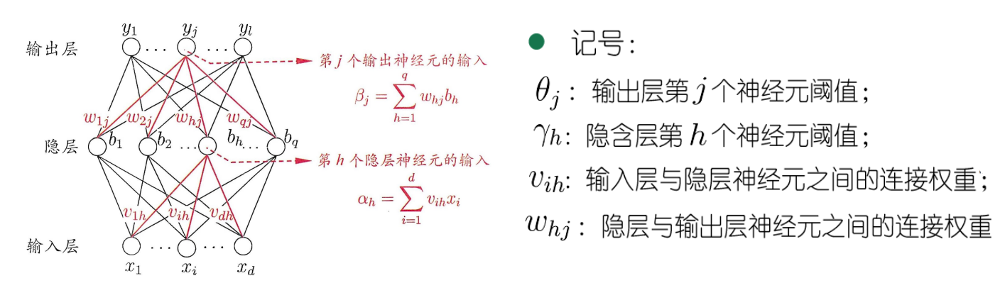
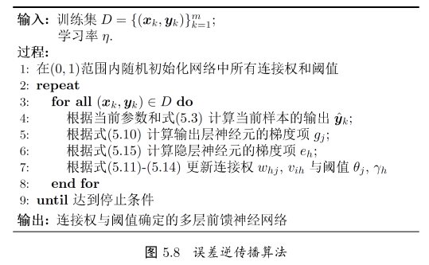
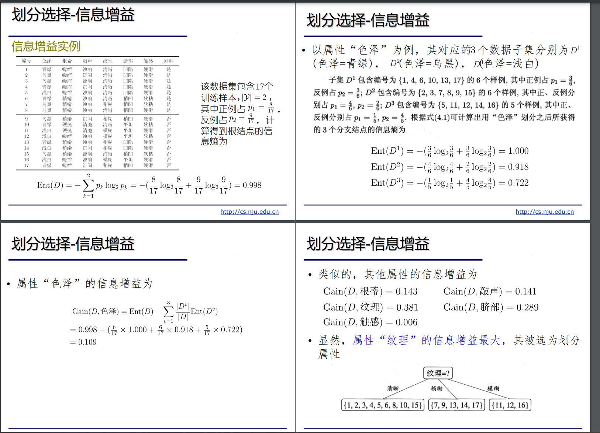
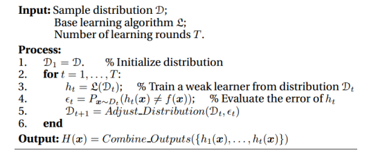
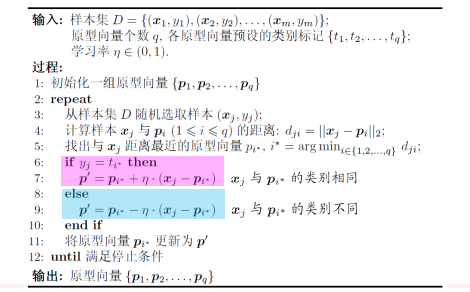

# 高级机器学习

# 第一讲 机器学习概述

## 机器学习

- 定义：机器利用数据学习人类经验，不断提高性能的过程
- 目标：模型具有泛化能力

## 人工智能发展阶段

- 60-70 年代：推理期
- 80 年代：知识期
- 90 年代：学习期

# 第二讲 模型评估和选择

## 模型评估

### 泛化误差 vs 经验误差

- 泛化误差：在测试样本上的误差
- 经验误差：在训练集上的误差，也叫做训练误差

### 过拟合 vs 欠拟合

- 在不存在严重过拟合或欠拟合现象时，经验误差和泛化误差可以进行相互界定

## 模型选择

### 经验误差

- 三个关键问题
  - 如何获得测试结果：评估方法
  - 如何评估性能优劣：性能度量
  - 如何判断实质差别：比较检验

#### 评估方法

- 留出法

  - 将数据集分为两个互斥集合——训练和测试集
  - 训练和测试集分得尽可能保持数据分布的一致性
  - 分层采样：保持类别比例一致
  - 通常比例控制在 2:1~4:1
- 交叉验证法

  - 先分为 k 个子集，每次用 k-1 个做训练集，剩下的做测试集
- 留一法

#### 性能度量

性能度量是衡量模型泛化能力的评价标准，反映了任务需求

- 回归任务：均方误差

  - $$
    E(f;D) = \frac{1}{m}\sum_{i=1}^{m}(f(x_i)-y_i)^2
    $$
- 分类任务：错误率和精度

  - 分类错误率：$E(f;D) = \frac{1}{m}\sum_{i=1}^{m}(f(x_i)\neq y_i)$
  - 精度：$acc(f;D) = 1-E(f;D)$
- 信息搜索：查准率与查全率

  - 查准率：$P = \frac{TP}{TP+FP}$（预测为正例的正确率）
  - 查全率：$R = \frac{TP}{TP+FN}$（所有正例能否预测出来）
  - F1 度量：$F1 = \frac{2\times P\times R}{P+R} = \frac{2\times TP}{样例总数+TP-TN}$
    - 更一般的形式：$F_\beta = \frac{1+\beta^2\times P \times R}{(\beta^2\times P)+R}$

#### 比较检验

- 测试性能不等于泛化性能
- 测试性能随着测试集的变化而变化
- 评估方法：T-检验

# 第三讲 线性模型

- 线性模型一般形式
  - $$
    f(x) = \omega_1x_1 + \omega_2x_2 + \dots + \omega_dx_d + b
    $$
  - 如何确定$\omega$和$b$的值，使得线性模型具有优良性能

## 回归任务模型：最小二乘法

### 线性回归

- 最小化均方误差：$E_{(\omega,b)} = \sum_{i=1}^m(y_i-\omega x_i-b)^2$
  - 分别对$\omega$和$b$求导：
    - $$
      \frac{\partial E_{(\omega,b)}}{\partial \omega} = 2(\omega\sum_{i=1}^mx_i^2-\sum_{i=1}^m(y_i-b)x_i)
      $$
    - $$
      \frac{\partial E_{(\omega,b)}}{\partial b} = 2(mb-\sum_{i=1}^m(y_i-\omega x_i))
      $$
  - 得到闭式解
    - $$
      \omega = \frac{\sum_{i=1}^my_i(x_i-\bar x)}{\sum_{i=1}^mx_i^2-\frac{1}{m}(\sum_{i=1}^mx_i)^2}
      $$
    - $$
      b = \frac{1}{m}\sum_{i=1}^{m}(y_i-\omega x_i)
      $$
    - $$
      \bar x = \frac{1}{m}\sum_{i=1}^mx_i
      $$

### 多元线性回归

$$
f(\boldsymbol{x_i}) = \boldsymbol{\omega^Tx_i} +b
$$

- 齐次表达
$$
    X = \begin{pmatrix}
    x_{11} & x_{12} & \dots & x_{1d} & 1 \\
    x_{21} & x_{22} & \dots & x_{2d} & 1 \\
    \vdots & \vdots & \ddots & \vdots & \vdots \\
    x_{m1} & x_{m2} & \dots & x_{md} & 1 \\
    \end{pmatrix} = \begin{pmatrix}
    \boldsymbol{x_1^T} & 1 \\
    \boldsymbol{x_2^T} & 1 \\
    \vdots & \vdots \\
    \boldsymbol{x_m^T} & 1 \\
    \end{pmatrix}
$$

- 最小二乘法：$\hat w^* = \argmin_{\hat w}(y-X\hat w)^T(y-X\hat w)$

  - 求导得到：$\frac{\partial E_{\hat \omega}}{\partial \hat\omega} = 2X^T(X\hat\omega - y)$
- 满秩讨论

  - $X^TX$是满秩矩阵或正定矩阵，则
    - $$
      \hat\omega^* = (X^TX)^{-1}X^Ty
      $$
    - $$
      f(\hat x_i) = \hat x_i^T(X^TX)^{-1}X^Ty
      $$
  - 如果不是满秩矩阵，则引入正则化

### 广义线性回归模型

- $$
  y = g^{-1}(\boldsymbol{\omega^Tx} +b)
  $$

## 二分类任务模型：对数几率回归

- 线性分类函数缺点：单位阶跃函数不连续，不可导
- 对数几率函数：$\ln \frac{y}{1-y} = \boldsymbol{\omega^Tx} +b$

  - 对数几率：$\ln \frac{p(y=1|x)}{p(y=0|x)} = \boldsymbol{\omega^Tx} +b$
- 对数几率回归：极大似然法

  - 对数似然函数：$\ell(\omega,b) = \sum_{i=1}^{m}\ln p(y_i|x_i; \omega_i,b)$
  - 可重写为：$\ell(\beta) = \sum_{i=1}^{m}(-y_i\beta^T\hat x_i + \ln(1+e^{\beta^T\hat x_i}))$

## 多分类任务模型

### 一对一

- 拆分阶段

  - N 个类别两两配对
  - 各个二类任务学习分类器
- 测试阶段

  - 新样本提交给所有分类器预测
  - 投票产生最终分类结果

### 一对其余

- 任务拆分

  - 某一类作为正例，其他反例
    - N 个分类任务
  - 各个二类任务学习分类器
    - N 个二类分类器
- 测试阶段

  - 新样本提交给所有分类器预测
    - N 个分类结果
  - 比较各分类器预测置信度
    - 置信度最大类别作为最终类别

### 两种策略比较

- 一对一

  - 需要$\frac{N(N-1)}{2}$个分类器，存储开销和测试时间大
  - 训练只用两个类的样例，训练时间短
- 一对其余

  - 训练 N 个分类器，存储开销和测试时间小
  - 训练用到全部训练样例，训练时间长

### 多对多

- 纠错输出码
  - ECOC 编码对分类器错误的容忍和修正能力：编码越长、纠错能力越强
  - 同等长度的编码，理论上，两个类别的编码距离越远，纠错能力越强

# 第四讲 支持向量机

## 线性模型

- 将训练样本分开的超平面可能有很多个，但是哪个最好？
  - 泛化能力最强的

## 间隔与支持向量

- 支持向量机：大间隔分类器
- 超平面方程: $\omega^T x + b = 0$
- 间隔：$\gamma = \frac{2}{\begin{Vmatrix}\omega\end{Vmatrix}}$

### 支持向量机-基本型

- 最大间隔：寻找参数$\omega$跟$b$，使得$\gamma$最大
- 优化问题：$\argmax_{\omega, b}\frac{2}{\begin{Vmatrix}\omega\end{Vmatrix}} s.t. y_i(\omega^T x_i +b) \ge 1, i=1,2,...,m$

  - 等价转化：$\argmin_{\omega, b}\frac{1}{2}\begin{Vmatrix}\omega\end{Vmatrix}^2\space
    s.t.\space
    y_i(\omega^T x_i +b) \ge 1, i=1,2,...,m$
  - 凸二次规划问题

### 支持向量机-对偶型

- 引入拉格朗日乘子$\alpha_i \ge 0$得到拉格朗日函数

  - $$
    L(\omega,b,\alpha) = \frac{1}{2}\begin{Vmatrix}\omega\end{Vmatrix}^2 + \sum_{i=1}^m\alpha_i(1-y_i(\omega^Tx_i+b))
    $$
- 求偏导：

  - $$
    \omega = \sum_{i=1}^{m}\alpha_iy_ix_i, \quad 0 = \sum_{i=1}^{m}\alpha_iy_i
    $$

- 回代解得$\max_\alpha \sum_{i=1}^m\alpha_i-\frac{1}{2}\sum_{i=1}^m\sum_{j=1}^m\alpha_i\alpha_jy_iy_jx_i^Tx_y, \quad s.t. \sum_{i=1}^m\alpha_iy_i = 0, \alpha_i \ge 0, \quad i=1,2,\dots,m$

### 基本型跟对偶型比较

- 基本型比较善于处理

  - 低维数据
  - 高维稀疏数据
- 对偶型善于处理高维稠密数据，容易吸收核函数处理非线性分类

## 特征空间映射

- 若不存在一个能正确划分两类样本的超平面，怎么办
  - 将样本从原始空间映射到一个更高维的特征空间，使样本在这个特征空间内线性可分

### 核函数

基本思路：设计核函数

$$
\kappa(x_i,x_j) = \phi(x_i)^T\phi(x_j)
$$

## 软间隔支持向量机

- 不再假设所有样本都可分，而是引入损失函数，计算每个样本的损失

  - $$
    \min_{\omega,b}\frac{1}{2}||\omega||^2 + C\sum_{i=1}^ml_{0/1}(y_i(\omega^T\phi(x_i)+b)-1)
    $$
- 存在问题

  - 0/1 损失函数非凸非连续，不好优化
- 替换方法

  - 采用 hinge 损失函数
- 基本型和对偶型

  - 原始问题：$\min_{\omega,b}\frac{1}{2}||\omega||^2 + C\sum_{i=1}^m\max(0,1-y_i(w_ix+b))$
  - 对偶问题：$\min_\alpha\frac{1}{2}\sum_{i=1}^m\sum_{j=1}^m\alpha_i\alpha_jy_iy_j\phi(x_i)^T\phi(x_j)-\sum_{i=1}^m\alpha_i, \quad s.t. \sum_{i=1}^m\alpha_iy_i = 0, 0\le \alpha_i\le C, i=1,2,\dots,m$
- SVM 拓展-正则化

# 第五讲 神经网络

## 神经网络发展史

- 第一阶段：感知机为代表
- 第二阶段：反向传播为代表
- 第三阶段：深度网络为代表

## 神经元模型

### M-P 神经元模型

- 输入：来自其他 n 个神经元传递过来的信号
- 处理：通过带权重连接进行传递，总值与神经元的阈值比较
- 输出：通过激活函数得到输出

### 神经元模型-激活函数

- 理想激活函数时阶跃函数，0 表示抑制神经元而 1 表示激活神经元
- 阶跃函数不连续不光滑，常用 Sigmoid 函数

## 感知机与多层网络

- 感知机由两层神经元组成，输入层接受外界输入信号传递给输出层，输出层是 M-P 神经元

### 感知机学习能力

- 当两类模式线性可分时，感知机的学习过程一定会收敛；否则感知机的学习过程将会发生震荡
- 单层感知机的学习能力有限，只能解决线性可分问题

  - 对于异或等不能线性可分的问题，感知机不能求得合适解

### 多层感知机

- 输出层和输入层之间的一层神经元，称为隐层或隐含层
- 隐含层和输出层神经元都是具有激活函数的功能神经元

### 多层前馈神经网络

- 定义：每两层神经元全互联，不存在同层连接和跨层连接
- 前馈：接受外界输入信号，隐含层与输出层神经元对信号进行加工输出
- 学习：根据训练数据调整神经元的“连接权”以及功能神经元的“阈值”
- 多层网络：包含隐层的网络

## 误差逆传播算法

- 误差逆传播算法是最成功训练多层前馈神经网络的学习算法
  - 给定训练集：$D = \{(x_i,y_i)\}, x_i\in R^d, y_i\in R^l$，输入示例有$d$个属性描述，输出$l$维实值向量

- 前向计算

  - $$
    b_h=f(\alpha_h-\gamma_h),\alpha_h = \sum_{i=1}^dv_{ih}x_i
    $$
  - $$
    \hat{y}_j^k = f(\beta_j-\theta_j), \beta_j = \sum_{i=q}^d\omega_{hj}b_h
    $$
  - $$
    E_k = \frac{1}{2}\sum_{j=1}^l(\hat{y}_j^k-y_j^k)^2
    $$
- 基于梯度下降策略，以误差率为目标，计算负梯度方向对参数进行调整

  - $$
    \Delta\omega_{hj} = -\eta\frac{\partial E_k}{\partial \omega_{hj}}
    $$
  - $$
    \frac{\partial E_k}{\partial \omega_{hj}} = \frac{\partial E_k}{\partial\hat y_j^k}. \frac{\partial\hat y_j^k}{\partial\beta_j}.\frac{\partial\beta_j}{\partial\omega_{hj}}
    $$
  - $$
    g_j = -\frac{\partial E_k}{\partial\hat y_j^k}.\frac{\partial\hat y_j^k}{\partial\beta_j}
    $$
- 学习率$\eta \in (0,1)$控制算法每一轮迭代的更新步长，太长容易震荡，太小收敛速度又会过慢

### 具体实现

- 标准 BP 算法

  - 每次对单个训练样例更新权值和阈值；单次计算开销小，但参数更新频繁，不同样例可能会相互冲突，迭代次数较多
- 累计 BP 算法

  - 最小化整个训练集上的累计误差$E = \frac{1}{m}\sum_{k=1}^mE_k$
  - 读取整个训练集后对更新参数，参数更新频率低，但单次计算开销大

### 多层前馈网络优缺点

- 强大的学习能力：多行足够多的神经元的隐层，多层前馈神经网络能以任意精度逼近任意复杂度的连续函数
- 局限

  - 经常过拟合
  - 如何设置隐层神经元个数是个难题
- 缓解过拟合的策略

  - 早停：训练过程中，若训练误差降低，但验证误差身高，则停止训练
  - 正则化：在误差目标函数中增加一项描述网络复杂程度的成分，防止模型过于复杂

## 全局最小与局部最小

- 跳出局部最小的常见策略
  - 模拟退火
  - 不同的初始参数
  - 随机扰动
  - 遗传算法

## 深度学习

- 深度学习模型是具有很多个隐层的神经网络
- 增加模型复杂程度的方式

  - 模型宽度：增加隐层神经元的数目
  - 模型深度：增加隐层数目
  - 实际应用中，增加模型深度比增加宽度相对更有效

### 训练方法

- 预训练 + 微调

  - 预训练：监督逐层，每次训练时间上一层隐层结构的输出作为输入，本层隐节点的输出作为输出，仅训练一层网络
  - 微调：预训练全部完成后，对整个网络进行微调训练，一般采用 BP 算法
- 权共享

  - 一组神经元使用相同的连接权值

### 卷积神经网络

- 卷积层：每个卷积层包含多个特征映射，每个特征映射通过一种卷积滤波器提取一种数据的特征
- 采样层：也叫作汇合层，其作用是基于局部相关性原理进行亚采样，从而在减少数据量的同时保留有用信息
- 连接层：每个神经元被全连接到上一层每个神经元，本质就是传统的神经网络，其目的是通过连接层和输出层的连接完成识别任务

# 第六讲 决策树

## 基本流程

- 策略：分而治之
- 递归过程：每个中间节点寻找一个划分属性
- 三种停止条件

  - 当前节点包含的样本全属于同一类别，无需划分
  - 当前属性集为空，或是所有样本在所有属性上取值相同，无法划分
  - 当前结点包含的样本集合为空，不能划分

## 划分选择

### 信息增益

$$
Gain(D,a) = Ent(D)-\sum_{v=1}^V\frac{|D^v|}{|D|}Ent(D^v)
$$

- 信息熵

  - 度量样本集合纯度最常用的一种指标，假定当前样本第 k 类样本所占比例为$p_k(k=1,2,...,|\gamma|)$，则 D 的信息熵定义为
  - $$
    Ent(D) = -\sum_{k=1}^{|\gamma|}p_k\log_2p_k
    $$
  - $Ent(D)$的值越少，$D$的纯度越高
- ID3

  - 信息增益越大，意味着使用属性 a 来进行划分所获得的纯度提升最大
  - 可以用信息增益来进行决策树的划分属性选择
- 信息增益偏好取值数多的属性

### 增益率

- C4.5

  - 信息增益准则对可取值数目较多的属性有偏好，会带来不利影响
  - 不直接使用信息增益，而是用信息增益率
  - $$
    Gain_ratio(D,a)=\frac{Gain(D,a)}{IV(a)}
    $$
  - $$
    IV(a) = -\sum_{v=1}^V\frac{|D^v|}{|D|}\log_2\frac{|D^v|}{|D|}
    $$
- 增益率准则偏好取值数较少的属性

## 过拟合和剪枝

- 决策树的不足：过拟合

  - 决策树的 决策分支较多，以至于把训练集自身的一些特点当作所有数据都具有一般性质而导致的过拟合
- 剪枝的基本策略

  - 预剪枝：边建树，边剪枝
  - 后剪枝：先建树，后剪枝

### 预剪枝

- 决策树生成过程中，对每个节点在划分前先进行估计，若当前节点的划分不能带来决策树泛化性能提升，则停止划分并将当前节点标记为叶节点，其类别标记为训练样例数最多的类别
- 优点

  - 降低过拟合的风险
  - 显著减少训练时间和测试时间的开销
- 缺点

  - 欠拟合。单看一步划分虽然不能提升泛化性能，但多看几步有可能提高性能
  - 基于贪心本质禁止分支展开，带来欠拟合风险

### 后剪枝

- 优点

  - 保留了更多的分支，欠拟合风险小，泛化性能往往优于预剪枝决策树
- 缺点

  - 训练时间开销大

## 多变量决策树

- 单变量决策树分类边界：轴平行
- 多变量决策树

# 第七讲 贝叶斯分类器

## 贝叶斯决策论

给定$N$个类别，令$\lambda_{ij}$代表将第$j$类样本误分为第$i$类所产生的损失，则基于后验概率将样本$x$分到第$j$类的风险为

$$
R(c_i|x) = \sum_{j=1}^N\lambda_{ij}P(c_j|x)
$$

- 贝叶斯判定法则

  - $$
    h^*(x) = \argmin_{c\in \gamma}R(c|x)
    $$

    - $h^*$称为贝叶斯最优分类器，其总体风险称为贝叶斯风险
    - 反映了学习性能的理论上限
  - 贝叶斯的核心工作:$P(c|x)$，但是很不好求
- 转化

  - $$
    P(c|x) = \frac{P(c)P(x|c)}{P(x)}
    $$

    - 可以假定每个样本出现概率一样
    - 每个样本的频率可以算
    - 所以只需要基于分类，判断一个样本的概率即可
    - 还是不好算
      - 在于$x$的维度可能会很大，会存在组合爆炸

## 朴素贝叶斯

主要障碍，所有属性上的联合概率难以从有限训练样本估计获得

- $$
  P(c|x) = \frac{P(c)P(x|c)}{P(x)} = \frac{P(c)}{P(x)}\prod_{i=1}^dP(x_i|c)
  $$

  - $d$为属性数，$x_i$为$x$在第$i$个属性上的取值
  - $P(x)$对所有类别相同，于是$h_{nb}(x) = \argmax_{c\in \gamma}P(c)\prod_{i=1}^dP(x_i|c)$
- 估计$P(c) = \frac{|D_c|}{|D|}$
- 估计$P(x|c)$

  - 对离散属性，令$D_{c,x_i}$表示$D_c$中在第$i$个属性上取值为$x_i$的样本组成的集合，则$P(x_i|c) = \frac{|D_{c,x_i}|}{|D_c|}$
  - 对连续属性，考虑概率密度函数，假定$p(x_i|c) \sim N(\mu_{c,i},\sigma^2_{c,i})$
- 拉普拉斯修正

  - 若某个属性值在训练集中没有与某个类同时出现过，则直接计算会出现问题，因为概率连乘会抹去其他属性提供的信息
  - 令$N$表示训练集$D$中可能得类别数，$N_i$表示第$i$个属性可能得取值数
    - $$
      \hat P(c) = \frac{|D_c|+1}{|D|+N}
      $$
    - $$
      \hat P(x_i|c) = \frac{|D_{c,x_i}|+1}{|D_c|+N_i}
      $$
- 使用

  - 若对预测速度要求高
    - 预计算所有概率估值，使用的时候查表
  - 若数据更替频繁
    - 不进行任何训练，收到预测请求时再估值（懒惰学习）
  - 若数据不断增加
    - 基于现有估值，对新样本涉及的概率估值进行修正（增量学习）

## 半朴素贝叶斯

- 基本思路：适当考虑一部分属性间的相互依赖信息
- 最常用策略：ODE

  - $$
    P(c|x) \propto P(c)\prod_{i=1}^dP(x_i|c,pa_i)
    $$
- 两种常见方法

  - SPODE
    - 假设所有属性都依赖于同一属性，称为超父，然后通过交叉验证登模型选择方法来确定超父属性
  - TAN
    - 以属性间的条件互信息为边的权重，构建完全图，再利用最大带权生成树算法，仅保留强相关属性间的依赖性

## 贝叶斯网络

- 贝叶斯网：$B = <G,\Theta>$
- 概率图模型

  - 有向图模型-> 贝叶斯网
  - 无向图模型-> 马尔科夫网

# 第八讲 集成学习

## 个体与集成

- 定义：集成学习通过多学习器来提升性能
- 理想情况

  - 假设基分类器的错误率为$P(h_i(x)\neq f(x)) = \epsilon$
  - 投票法结合$T$个分类器，超过半数的基分类器正确则分类就正确$H(x) = sign(\sum_{i=1}^{T}h_i(x))$
  - 假设基分类器的错误率相互独立，则由 Hoeffding 不等式可得$P(H(x)\neq f(x)) \le exp(-\frac{1}{2}T(1-2\epsilon)^2)$
  - 在一定条件下，随着集成分类器的数目增加，集成的错误率将指数级下降
- 现实

  - 关键假设：基分类器的误差相互独立
  - 现实任务重，个体学习器来自同一个问题，不可能完全独立
  - 事实上，个体学习器的准确性和多样性本身就存在冲突
  - 如何产生好而不同的个体学习器是集成学习研究的核心
  - 集成学习大致可以分为两大类：串行和并行

## Boosting

- 每次调整训练数据的样本分布
- 串行生成
- 个体学习器存在强依赖关系

### AdaBoost 推导

- 基学习器的线性组合$H(x) = \sum_{t=1}^{T}\alpha_th_t(x)$
- 最小化指数损失函数$\ell_{exp}(H|D) = E_{x\sim D}[e^{-f(x)H(x)}]$
- 令上式对的 H 的偏导值为 0，即$\frac{\partial\ell_{exp}(H|D)}{\partial H(x)} = -e^{-H(x)}P(f(x) = 1|x) + e^{H(x)}P(f(x)=-1|x)$

## Bagging 与随机森林

- 个体学习不存在强依赖关系
- 并行化生成
- 自主采样法
- 时间复杂度低
- 可使用包外估计

### 包外估计

- $H^{oob}(x)$表示对样本$x$的包外预测，即仅考虑那些未使用样本$x$训练的基学习器在$x$上的预测$H^{oob}(x) = \argmax_{y\in \gamma}\sum_{t=1}^T|h_t(x)=y|*|x\notin D_t|$

## 结合策略

### 投票法

- 绝对多数投票法
- 相对多数投票法
- 加权投票法

### 学习法

- Stacking

## 多样性

- 数据样本扰动
- 输入属性扰动
- 输出表示扰动
- 算法参数扰动

# 第九讲 聚类

## 聚类任务

- 目标：将数据样本划分为若干个通常不相交的簇

## 性能度量

- 外部指标

  - 将聚类结果与某个参考模型进行比较，Jaccard 系数、FM 指数，Rand 指数
- 内部指标

  - 直接参考聚类结果，DB 指数，Dunn 指数等
- 基本想法：

  - 簇内相似度高且簇间相似度低

## 距离计算

- 距离度量需要满足的基本性质

  - 非负性：$dist(x_i,x_j) \ge 0$
  - 同一性：$dist(x_i,x_j) = 0$当且仅当$x_i=x_j$
  - 对称性：$dist(x_i,x_j) = dist(x_j,x_i)·$
  - 直递性：$dist(x_i,x_j) \le dist(x_i,x_k)+dist(x_k,x_j)$
- 常用距离公式

  - 闵可夫斯基距离$dist_{mk}(x_i,x_j) = (\sum_{u=1}^n|x_{iu}-x_{ju}|^p)^{\frac{1}{p}}$
  - $p=2$欧氏距离
  - $p=1$曼哈顿距离
- 对无序属性，可使用 VDM

  - 令$m_{u，a}$表示属性$u$上取值为$a$的样本数，$m_{u,a,i}$表示在第$i$个样本簇中在属性$u$上取值为$a$的样本数，$k$为样本簇数，则属性$u$上两个离散值$a$与$b$之间的 VDM 距离为$VDM_p(a,b) = \sum_{i=1}^k|\frac{m_{u,a,i}}{m_{u,a}} - \frac{m_{u,b,i}}{m_{u,b}}|^p$
- 对混合属性，可使用 MinkovVDM

  - $$
    MinkovDM_p(x_i,x_j) = (\sum_{u=1}^{n_c}|x_{iu}-x_{j,u}|^p + \sum_{u=n_c+1}^n VDM_p(x_{i,u},x_{j,u}))^{\frac{1}{p}}
    $$
- 聚类的好坏没有绝对标准

## 原型聚类

### k-means

- 每个簇中心以该簇中所有样本点的均值表示
  - 随机选取$k$个样本中心点作为簇中心
  - 将其他样本点根据其与簇中心的距离，划分给最近的簇
  - 更新各簇的均值向量，将其作为新的簇中心
  - 若所有的簇中心未发生改变，则停止；否则执行步骤 2

### 学习向量量化（LVQ）

- 也是试图找到一组原型向量来刻画聚类结构，但数据样本带有类别标记

### 高斯混合聚类（GMM）

- 采用高斯概率分布来表达聚类原型，簇中心=均值，簇半径=方差

## 密度聚类

### DBSCAN

- 关键概念
  - 核心对象：若$x_j$的$\epsilon$-邻域至少包含$MinPts$个样本，即$|N_{\epsilon}(x_j)| \ge MinPts$，则$x_j$是一个核心对象
  - 密度直达：若$x_j$位于$x_i$的$\epsilon$-领域中，且$x_i$是核心对象，则称$x_j$由$x_i$密度直达
  - 密度可达：对$x_i$与$x_j$，若存在样本序列$p_1,p_2,\dots,p_n$其中$p_1=x_i$，$p_n=x_j$且$p_{i+1}$由$p_i$密度直达，则称$x_j$由$x_i$密度可达
  - 密度相连

## 层次聚类

### AGNES

- 从最细的粒度开始（一个样本一个簇），逐渐合并相似的簇，知道最粗的粒度（所有样本一个簇）
  - 将每个样本点作为一个簇
  - 合并最近的两个簇
  - 若所有样本点都存在于一个簇中，则停止；否则继续步骤 2

# 第十章 降维与度量学习

## k-近邻学习

- k 近邻学习室懒惰学习的代表

  - 懒惰学习：事先没有分类器，见到测试样本才开始准备分类器
- 基本思路

  - 近朱者赤，近墨者黑
  - 关键：k 值选取，距离计算
- 重要性质

  - 给定测试样本 x，若其最近样本为 z，则最近邻分类器出错的概率就是 x 和 z 类别标记不同的概率
    - $$
      \begin{aligned}
      P(err) &= 1-\sum_{c\in \gamma}P(c|x)P(c|z) \\
      &\simeq 1-\sum_{c\in \gamma}P^2(c|x) \\
      &\le 1-P^2(c^*|x) \\
      &= (1+P(c^*|x))(1-P(c^*|x)) \\
      &\le 2\times (1-P(c^*|x)
      \end{aligned}
      $$

- 维数灾难
  - 高维空间给距离计算带来很大的麻烦
  - 样本变得稀疏，近邻容易不准

## 低维嵌入

### 多维缩放方法（MDS）

- MDS 旨在寻找一个低维子空间，使得距离和样本原有距离近似不变
- 寻找低维子空间尽量保持样本内积不变

  - 思路：特征值分解
  - 设样本之间的内积矩阵均为 B，对 B 进行特征值分解：$B = V\Lambda V^T$

## 流形学习

### ISOMAP

- 基本步骤
  - 构造近邻图
  - 基于最短路径算法近似任意两点之间的测地线距离
  - 基于距离矩阵通过 MDS 获得低维嵌入

### LLE

- 基本步骤
  - 为每个样本构造近邻集合$Q_i$
  - 为每个样本计算基于$Q_i$的线性重构系数：$\min_{w_1,w_2,\dots,w_m} \sum_{i=1}^m\lVert x_i-\sum_{j\in Q_i}w_{ij}x_j \rVert^2_2 \quad s.t. \sum_{j\in Q_i}w_{ij} = 1$
  - 在低维空间中保持$w_{ij}$不变，求解下式$\min_{z_1,z_2,\dots,z_m} \sum_{i=1}^m\lVert z_i-\sum_{j\in Q_i}w_{ij}z_j \rVert^2_2$

## 度量学习

降维希望找到一个合适低维空间下的距离度量

- 能够通过参数化来学习距离度量

  - 马氏距离$dist^2_{mah}(x_i,x_j) = (x_i-x_j)^TM(x_i-x_j) = \lVert x_i-x_j\rVert^2_M$
- 欧氏距离

  - 缺陷：各个方向同等重要

## 主成分分析 PCA

- 正交属性空间中的样本点，如何使用一个超平面对所有样本进行恰当的表达
- 若存在这样的超平面，那么它大概具有这样的性质

  - 最近重构性：样本点到这个超平面的距离都足够近
  - 最大可分性：样本点在这个超平面上的投影能尽可能分开

### 最近重构性

- 对样本进行中心化：$\sum_ix_i = 0$
- 假定投影变换后得到的新坐标系为$\{\omega_1,\omega_2,\dots,\omega_d\}$，其中$\omega_i$是标准正交基向量：$\lVert \omega_i\rVert_2 = 1, \omega_i^T\omega_j = 0(i\neq j)$
- 若丢弃新坐标系中的部分坐标，即将维度降低到$d^{\prime}\lt d$则样本点在低维坐标系中的投影是$z_i = (z_{i1};z_{i2};\dots;z_{id^{\prime}}) \quad z_{ij} = \omega_j^Tx_i$
- 若基于$z_i$来重构$x_i$，则会得到$\hat x_i = \sum_{j=1}^{d^{\prime}}z_{ij}\omega_j$
- 原样本点$x_i$与基于投影重构的样本点$\hat x_i$之间的距离为:$\sum_{i=1}^m\lVert\sum_{j=1}^{d^{\prime}}z_{ij}w_j - x_i\rVert^2_2 = \sum_{i=1}^mz_i^Tz_i - 2\sum_{i=1}^mz_i^TW^Tx_i+const \propto -tr(W^T(\sum_{i=1}^mx_ix_i^T)W)$

### 最大可分性

- 样本点$x_i$在新空间中超平面上的投影是$W^Tx$，若所有样本点的投影尽可能分开，则应该是的投影后的样本方差最大化
