# 分布式系统

# 概述

## 分布式系统的定义

- 分布式系统是若干独立计算机的集合，这些计算机对于用户来说就像是单个相关系统
- 为了使各类异构的计算机和网络都呈现为单个的系统，分布式系统常常通过一个软件层组织起来，这样的分布式系统有时又称为中间件

## 目标

- 使资源可访问
- 透明性：如果一个分布式系统能够在用户和应用程序面前呈现为单个计算机系统，这样的分布式系统就称为是透明的

  - 访问透明性：对不同数据的表示形式以及资源访问的隐藏
  - 位置透明性：用户无法感知到资源在系统中的物理位置
  - 迁移透明性：分布式系统的资源迁移不会影响该资源的访问方式
  - 重定向透明性：资源可以在接收访问的同时进行重新定位而不引起用户和应用程序的注意
  - 复制透明性：对同一资源存在多个副本这样一个事实的隐藏
  - 并发透明性：确保对共享资源的并发访问不会破坏资源的一致状态
  - 故障透明性：用户不会注意到某个资源无法正常工作
- 开放性

  - 开放的分布式系统：根据一系列准则来提供服务，这些准则描述了服务的语法与语义
  - 分布式系统中服务通常通过接口指定，接口一般是通过接口定义语言描述
  - 互操作性：来自不同厂商的系统或组件的两种实现能够在何种程度上共存并且协同工作
  - 可移植性
  - 做法：策略与机制分离
    - 机制：对应一个接口。例如万维网的缓存机制
    - 策略：对应具体做法。允许用户修改缓存策略
- 可扩展性

  - 规模上扩展
  - 地域上扩展
  - 管理上扩展

## 分布式系统的类型

### 分布式计算系统

#### 集群计算系统

- 每个群都是由一个计算机节点集组成的，它们可以由单个主节点来控制和访问

#### 网格计算系统

- 网格计算系统具有高度的异构性：其硬件、操作系统、网络、管理域和安全策略等都不尽相同

### 分布式信息系统

#### 事务处理系统

对事务处理的程序要求有特定的原函数，即必须能被底层的分布式系统或编程语言的运行时系统所支持。

- 事务的 4 个特性
  - 原子性：对于外部来说，事务处理是不可见的
  - 一致性：事务处理不会违反系统的不变性
  - 独立性：并发的事务处理不会互相干扰
  - 持久性：事务处理一旦提交，所发生的改变是永久性的

#### 企业应用集成

- 通信中间件
  - 远程过程调用：通过一个本地过程调用，有效地往另一个应用程序组件发送一个请求
  - 远程方法调用：操作的是对象而不是应用程序
  - 面向消息的中间件：发布订阅系统

### 分布式普适系统

# 体系结构

## 体系结构的样式

- 分层体系结构：计算机网络
- 基于对象的体系结构：RPC
- 以数据为中心的体系结构：Web
- 基于事件的体系结构：发布订阅系统

## 系统体系结构

### 集中式体系结构

- 应用分层
- 多层体系结构

### 非集中式体系结构

- 结构化点对点体系结构
- 非结构化的点对点体系结构
- 覆盖网络的拓扑管理
- 超级对等体

### 混合体系结构

# 进程

## 代码迁移

### 代码迁移方案

- 理由：把进程由负载较重的机器上转移到负载较轻的机器上去
- 代码迁移模型

  - 代码段
  - 资源段
  - 执行段
- 形式

  - 弱可移动性：代码段与初始化数据
  - 强可移动性：传输执行段

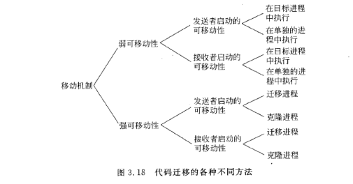

### 迁移与本地资源

- 按标识符绑定：进程明确指定的只是要引用哪些资源
- 按类型绑定：进程指指明它需要哪一种类型的资源

### 异构系统中的代码迁移

# 通信

## 基本概念

### 通信类型

- 持久通信：提交传输的消息一直由通信中间件存储，直到该消息被传送给接收方为止
- 瞬时通信：通信系统只有在发送和接收应用程序正在运行时才存储消息
- 异步通信：发送方在提交要传输的消息立即往下执行
- 同步通信：发送方将被阻塞，直到知道其请求被接受以后

## 远程过程调用

机器 A 上的进程调用机器 B 上的进程时，A 上的调用进程被挂起，而 B 上的被调用进程开始执行

总的来说，远程过程调用包含下列步骤：

1. 客户过程以正常的方式调用客户存根
2. 客户存根生成一个消息，然后调用本地操作系统
3. 客户端操作系统将消息发送给远程操作系统
4. 远程操作系统将消息发给服务器存根
5. 服务器存根将参数提取出来，然后调用服务器
6. 服务器执行要求的操作，操作完成后将结果返回给服务器存根
7. 服务器存根将结果打包成一个消息，然后调用本地操作系统
8. 服务器操作系统将含有结果的消息发送回客户端操作系统
9. 客户端操作系统将消息交给客户存根
10. 客户存根将结果从消息中提取出来，返回给调用它的客户过程

# 命名系统

## 名称、标识符和地址

- 访问点：要对实体进行操作，就需要访问实体，因此需要一个访问点
- 地址：访问点的名称称为地址
- 标识符：具有以下属性的名称

  - 一个标识符最多引用一个实体
  - 每个实体最多由一个标识符引用
  - 一个标识符始终引用同一个实体

## 无层次命名

### 简单方法

- 广播与多播：随着网络的膨胀广播开始变得低效
- 转发指针：

  - 链可能会特别长
  - 只要需要，链中的所有中间位置就必须维护它们的那一部分转发指针链
  - 所在的链很脆弱，易断开

### 基于宿主位置的方法

- 每个移动主机都有一个固定的 IP 地址，所有与该 IP 地址进行的通信一开始都被转发到移动主机的宿主代理中
- 当一台移动主机转移到另一个网络中时，它会请求一个可以用来通信的临时地址，这种转交地址要在宿主代理中注册
- 当宿主代理接收到发给移动主机的数据包时，它会查找主机的当前位置

  - 如果主机是在当前本地网络中，那么就只需转发数据包
  - 否则，建立一条通往主机当前位置的通道，也就是说，它会把数据组装成 IP 包，然后发送给转交地址。同时，将把主机的当前位置告诉数据包的发送者
- 缺点：

  - 必须保证宿主位置始终存在

### 分层方法

- 分层方案中，网络被划分为一组域，有一个覆盖整个网络的顶级域，每个域又可以进一步分成多个更小的子域
- 查询操作

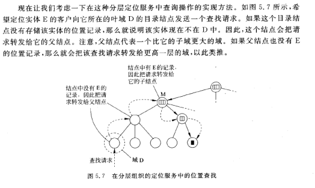

- 更新操作

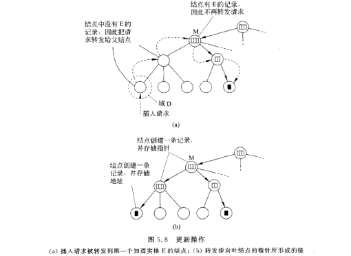

# 同步化

## 时钟同步

### 时钟同步算法

- 网络时间协议：客户与时间服务器联系
  

  - 创建了两条连接，B 也可以探查 A 的当前时间，延时的计算如下

  $$
  igma = \frac{(T_2-T_1) + (T_4-T_3)}{2}
  $$
- Berkeley 算法

  - 时间服务器是主动的，定期地询问每台机器的时间
  - 基于这些回答，计算出一个平均时间，并告诉所有其他机器将它们的时钟拨快到一个新的时间
  - 基于这些回答，计算出一个平均时间

## 逻辑时钟

### Lamport 逻辑时钟

- 计数器更新
  - 在执行一个事件之前（如在网络上发送一个消息，传送一个消息给应用程序，或者其他内部事件），$P_i$执行$C_i \leftarrow C_i+1$
  - 当进程$P_i$发送一个消息 m 给$P_i$时，在执行前面的步骤后，把 m 的时间戳$ts(m)$设置为等于$C_i$
  - 在接收消息 m 时，进程$P_i$调整自己的局部计数器为$C_j \leftarrow \max \{C_i, ts(m)\}$，然后执行第一步，并把消息传送给应用程序

### 向量时钟

- Lamport 不能捕获因果关系

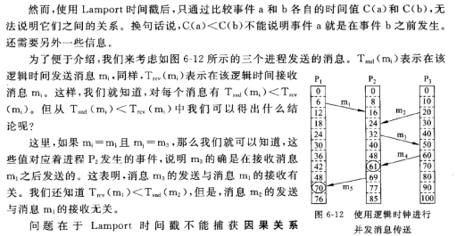

- 向量时钟的创建是通过让每个进程$P_i$维护一个向量$VC_i$来完成的，该向量具有下面两个性质

  - $VC_i[i]$是到目前为止进程$P_i$发生的事件的数量
  - 如果$VC_i[j]=k$,那么进程$P_i$知道进程$P_j$中已经发生了 k 个事件。因此，$P_i$知道$P_j$的逻辑时间
- 步骤

  - 在执行一个事件之前（如在网络上发送一个消息，传送一个消息给应用程序，或者其他内部事件），$P_i$执行$VC_i[i] \leftarrow VC_i[i] + 1$
  - 当进程$P_i$发送一个消息 m 给$P_i$时，在执行前面的步骤后，把 m 的时间戳$ts(m)$设置为等于$VC_i$
  - 当接收消息 m 时，进程$P_j$通过为每个 k 设置$VC_j[k] \leftarrow \max \{ VC_j[k], ts(m)[k] \}$来调整自己的向量。然后，执行第一步，并把自己的消息传送给应用程序

## 互斥

### 集中式算法

选举一个进程作为协作者，无论何时一个进程要访问共享资源，都要向协作者发送一个请求消息，说明它想要访问哪个资源并请求准许

### 分布式算法

该算法的工作过程如下：当一个进程要访间一个共享资源时，它构造一个消息，其中包含它要访问的资源名、它的进程号和当前（逻辑）时间。然后，它将该消息发送给所有其他的进程，理论上讲也包括它自己，假设消息的传送是可靠的，也就是说，没有消息丢失。

当一个进程接收到来自另一个进程的请求消息时，它根据自己与消息中的资源相关的状态来决定它要采取的动作。可以分为三种情况

- 若接收者没有访问资源，而且也不想访问它，就向发送者发送一个 OK 消息。
- 若接收者已获得对资源的访问，那么它就不进行应答，而是将该请求放入队列中。
- 如果接收者想访问费源但尚未访问时，它收到的消息的时间截与包含在它发送给其他进程的消息中的时间藏进行比较。时间戳最早的那个进程获胜。如果收到的消息的时间截比较早，那么接收者向发送者发回一个 OK 消息，如果它自己的消息的时间截比较队列中，并且不发送任何消息

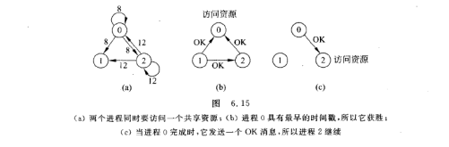

### 令牌环算法

- 环初始化时，进程 0 得到一个令牌
- 令牌绕着环运行，用点对点发送消息的方式把令牌从进程 k 传到进程 k+1
- 拿到令牌的资源检查自己是否需要访问资源

  - 要。继续完成要做的工作，然后释放资源
  - 不要。向下传递

## 选举算法

### 传统的选举算法

- 欺负算法

  - 任何一个进程发现协作者不再响应请求的时候，它就发起一次选举，按照如下过程
    - P 向所有编号比它大的进程发送一个 `ELECTION` 消息
    - 如果无人响应，P 获胜并成为协作者
    - 如果有编号比它大的进程的响应，则由响应者接管选举工作，P 的工作完成
- 环算法

  - 当任何一个进程注意到协作者不工作时，它就构造一个带有他自己的进程号的 `ELECTION` 消息并把消息发送给它的后继者
  - 如果后继者崩溃了，发送者沿着此环跳过它的后继者发送给下一个进程，直到找到一个正在运行的进程
  - 最终消息返回到此次选举的进程，当发起者进程接收到一个包含它自己的进程号的消息时，它识别出这个事件。此时该进程再一次绕环运行，向所有进程通知谁是协作者

# 一致性与复制

## 概述

### 原因

- 可靠性

  - 当一个副本被破坏后，文件系统只需转换到另一个数据副本就可以继续执行下去
- 性能

  - 当分布式系统需要在服务器数量和地理区域上进行扩展时，复制对于提高性能时相当重要的

## 以数据为中心的一致性模型

### 严格一致性

任何读的结果都是最近的一次写的结果

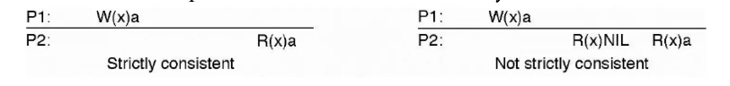

### 顺序一致性

任何执行结果都是相同的，就好像所有进程对数据存储的读写操作是按照某种序列顺序执行的，并且每个进程的操作按照程序所制定的顺序出现在这个序列中

### 线性一致性

所有进程的读写都以某种串行方式执行，顺序以及各个进程的操作维持的顺序是指定的

### 因果一致性

一种弱化的顺序一致性模型，将具有潜在因果关系的事件和没有因果关系的事件区分开来

- 所有进程必须以相同的顺序看到具有潜在因果关系的写操作，不同机器上可以以不同的顺序看到并发的写操作

### FIFO 一致性

通过单一的进程写在其他的进程看来顺序是一致的，但是不同的进程写在其他的进程看来就未必一致

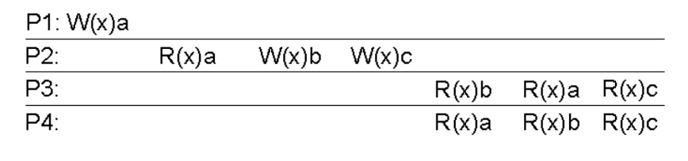

### 弱一致性

在所有先前的所有写入都已到处完成之前，不允许对同步变量进行任何操作

### 释放一致性

在对共享变量的读写操作释放之前，之前所有的请求都必须被成功执行

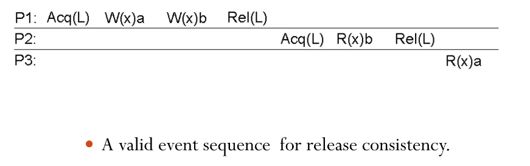

### 入口一致性

不允许执行同步变量的获取访问，直到对受保护的共享数据的所有更新都已完成为止

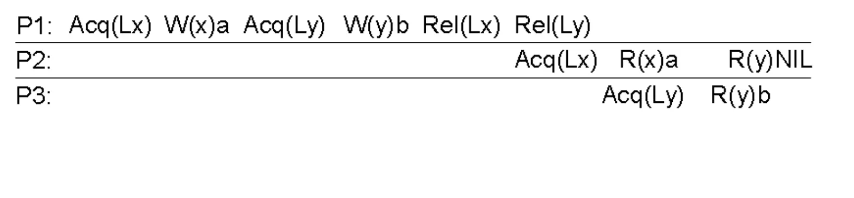

## 以客户为中心的一致性模型

### 最终一致性

- 为什么要最终一致性？

  - 大多数进程几乎从不执行更新操作，而只从数据库读取数据
  - 只有部分进程被允许更新名称空间中它所负责的部分，基本不会出现写-写操作冲突，唯一需要处理的情况是读-写操作冲突。这种情况通常允许以懒惰的方式传播更新操作
- 什么是最终一致性？

  - 如果在一段很长的时间内没有更新操作，那么所有的副本将逐渐地成为一致的，这种形式的一致性称为最终一致性

### 单调读一致性

- 定义
  - 如果一个进程读取数据项 x 的值，那么对该 x 执行的任何后续读操作将总是看到第一个读取的那个值或更新的值

### 单调写一致性

- 定义
  - 一个进程对数据项 x 执行的写操作必须在对该进程对 x 执行的任何后续写操作之前完成
    

### 读写一致性

- 定义
  - 一个进程对数据项 x 执行一次写操作的结果总是会被该进程对 x 执行的后续读操作看见

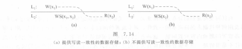

### 写读一致性

- 定义
  - 同一个进程对数据项 x 执行的读操作之后的写操作，保证发生在与 x 读取值相同或比之更新的值上

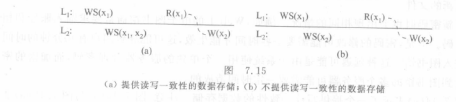

## 一致性协议

### 持续一致性

### 基于主备份的协议

事实证明，在顺序一致性中，基于主备份的协议比较盛行。在这些协议中，数据存储中的每个数据项有一个相关的主备份，该主备份负责协调在 x 上的写操作。根据主备份是否固定在一个远程服务器上，还是将主备份移动到启动写操作的进程那里之后写操作是否可以在本地执行，可以区分各种主备份协议

#### 远程写协议

- 定义
  - 所有读操作和写操作都转发给单个固定的远程服务器的协议

- 问题
  - 阻塞操作：性能问题，启动更新的进程在被允许继续执行前，可鞥需要等待较长的时间
  - 非阻塞操作：容错能力。

#### 本地写协议

- 定义

  - 其主副本在要执行写操作的进程之间迁移。当某个进程要更新数据项 x 时，先定位 x 的主副本，然后把它移到自己的位置上
- 优点

  - 可以在本地执行多个连续的写操作，而读操作仍可以访问其本地副本

### 复制的写协议

写操作可以在多个副本上执行，而不是像主备份的副本那样只在一个副本上执行

#### 主动复制

- 定义
  - 每个副本有一个相关联的进程，该进程执行更新操作

#### 基于多数表决的协议

- 定义（基本思想）

  - 要求客户在读或写一个复制的数据项之前向多个服务器提出请求，并获得他们的许可
    - 更新一个文件，必须先联系至少半数加一个服务器，得到他们的认可
    - 读取一个复制文件，也必须联系至少半数加一个服务器，请求返回该文件的关联版本号，如果版本号一致，那么必定是最新的版本
- Gifford 方案

  - 一个客户要读取一个具有 N 个副本的文件，必须组织一个读团体$N_R$
  - 要修改一个文件，客户必须组织一个至少有$N_W$个服务器的写团体
  - 限制条件
    - $$
      N_R + N_W > N
      $$
    - $$
      N_W > N / 2
      $$
  - 第一个条件是为了防止读写操作冲突，第二个限制条件是为了防止读读操作冲突

### 高速缓存相关性协议

# 容错性

## 容错性概述

### 基本概念

- 可靠的系统
  - 可用性：系统已经准备好，马上就可以使用
  - 可靠性：系统可以无障碍地持续运行
  - 安全性：系统在偶然出故障的情况下能正确操作而不会造成任何灾难
  - 可维护性：发生故障的系统能恢复的难易程度

### 使用冗余掩盖故障

- 信息冗余

  - 添加额外的位可以使错乱的位恢复正常
- 时间冗余

  - 执行一个动作，如果需要就再次执行
- 物理冗余

  - 通过添加额外的装备或进程使系统作为一个整体来容忍部分组件的失效或故障成为可能

## 可靠的客户-服务器通信

### RPC 调用失败

- RPC 调用失败类型以及解决方案
  - 客户端无法定位服务器
    - 使用特殊的返回码
    - 抛出异常
  - 客户端发送到服务器的请求消息丢失
    - 使用定时器
  - 服务器返回给客户端的响应消息丢失
    - 使用定时器
  - 服务器接收到请求后崩溃
    - 服务器重启之前不断尝试，这种技术被称为至少一次语义
    - 立即放弃并回滚，保证 RPC 最多一次执行语义
    - 客户端什么也不做
  - 客户端发送消息后崩溃
    - 孤儿消灭：在客户存根发送 RPC 消息前进行日志记录说明要做什么，重新启动前对日志进行检查然后明确杀死孤儿
    - 再生：客户端恢复后广播重启新一个轮次的请求，所有与那个客户有关的远程计算都被杀死
    - 优雅重生：在新时期广播到达时，每台机器都进行检查来查看是否存在远程计算，如果有，就尝试定位它的拥有者，只有当不能找到拥有者时才杀死该计算
    - 到期：每个 RPC 都有一个标准的时间 T，如果到时间还不能结束，就必须显式地请求另外的时间量

## 分布式提交

### 两阶段提交

由两个阶段组成，每个阶段又由两部组成。表决阶段的第一阶段由 12 组成，第二阶段是决定阶段由 34 组成。

1. 协作者向所有的参与者发送一个 `VOTE_REQUEST` 消息
2. 当参与者接收到 `VOTE_REQUEST` 消息时，就向协作者返回一个 `VOTE_COMMIT` 消息通知协作者它已经准备好本地提交事务中属于它的部分，否则就返回一个 `VOTE_ABORT` 消息
3. 协作者收集来自参与者的所有选票。如果所有的参与者都表决要提交事务，那么协作者就进行提交。在这种情况下它向所有的参与者发送一个 `GLOBAL_COMMIT` 消息。但是，如果有一个参与者表决要取消事务，那么协作者就决定取消事务并多播一个 `GLOBAL_ABORT` 消息
4. 每个提交表决的参与者都等待协作者的最后反应。如果参与者收到一个 `GLOBAL_COMMIT` 消息，那么它就在本地提交事务，否则当接收到一个 `GLOBAL_ABORT` 消息时，就在本地取消事务

### 三阶段提交

两阶段的一个问题是当协作者崩溃时，参与者不能做出最后的决定。参与者需要在协作者恢复之前保持阻塞

## 恢复

### 概述

- 回退恢复

  - 将系统从当前的错误状态回到先前的正确状态
  - 每次记录系统的当前状态时，就成为设置一个检查点
- 前向恢复

  - 尝试从可以继续执行的某点开始把系统带入一个正确的新状态

### 检查点

- 独立的检查点：进程独立地设置本地检查点
- 协调检查点：
