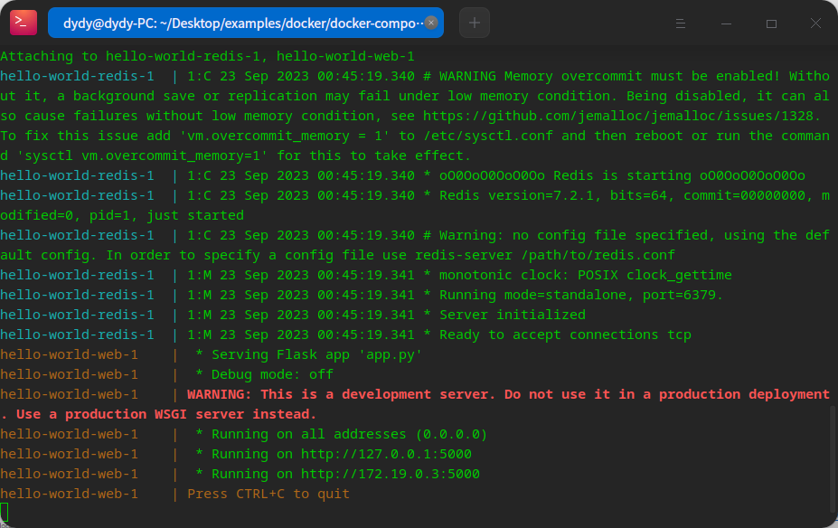

# Docker

## 环境安装

卸载旧版本残留

```bash
sudo apt-get remove docker.io docker-engine
```

1. 下载并安装密钥

```bash
curl -fsSL https://mirrors.ustc.edu.cn/docker-ce/linux/debian/gpg | sudo apt-key add -
```


2. 检查是否安装成功

```bash
sudo apt-key fingerprint 0EBFCD88
```


3. 在source.list中添加docker-ce的软件源

```bash
sudo deepin-editor /etc/apt/sources.list.d/docker.list # 使用 deepin 默认的编辑器新建并打开 docker.list 文件
# 写入一条内容如下：
deb [arch=amd64] https://mirrors.ustc.edu.cn/docker-ce/linux/debian buster stable # 这里 buster 是 debain 版本的代号，deepin20 是debain10 代号为 buster，编辑完成后保存
```

注意： 使用 cat /etc/debian_version 查看自己的 debain 版本。

4. 更新仓库

```bash
sudo apt update
```
5. 安装docker

```bash
sudo apt install docker-ce docker-ce-cli containerd.io
```

6. 验证


7. 管理启动项

```bash
sudo apt install chkconfig 
# 列出所有启动项
sudo chkconfig
# chkconfig --help 查看帮助命令

sudo chkconfig --del docker
```


8. Rootless 配置

```bash
sudo usermod -aG docker $USER
reboot
```

## 常用命令
### 拷贝文件夹

```bash
docker cp <container>:<container-dir> <local-dir>
```

# Docker Compose

## 环境安装
1. 下载二进制包


https://github.com/docker/compose/releases


2. 添加权限并移动到/usr/local/bin下

```bash
sudo chmod 755 docker-compose-linux-x86_64
sudo mv docker-compose-linux-x86_64 /usr/local/bin/docker-compose
```


3. 验证

```bash
docker-compose
```


## 简单示例


### 1. 定义应用依赖

使用一个简单的程序

```py
import time

import redis
from flask import Flask

app = Flask(__name__)
cache = redis.Redis(host='redis', port=6379)

def get_hit_count():
    retries = 5
    while True:
        try:
            return cache.incr('hits')
        except redis.exceptions.ConnectionError as exc:
            if retries == 0:
                raise exc
            retries -= 1
            time.sleep(0.5)

@app.route('/')
def hello():
    count = get_hit_count()
    return 'Hello World! I have been seen {} times.\n'.format(count)
```


并提供其软件包`requirements.txt`

```bash
flask
redis
```


### 2. 定义一个Dockerfile

```dockerfile
# syntax=docker/dockerfile:1
FROM python:3.7-alpine
WORKDIR /code
ENV FLASK_APP=app.py
ENV FLASK_RUN_HOST=0.0.0.0
RUN apk add --no-cache gcc musl-dev linux-headers
COPY requirements.txt requirements.txt
RUN pip install -r requirements.txt
EXPOSE 5000
COPY . .
CMD ["flask", "run"]
```


### 3. 定义一个compose文件

```dockerfile
services:
  web:
    build: .
    ports:
      - "8000:5000"
  redis:
    image: "redis:alpine"
```


### 4. 构建运行
运行`docker compose up`




停止运行`docker compose down`


### 5. compose文件添加挂载

重新编辑一下compose文件

```dockerfile
services:
  web:
    build: .
    ports:
      - "8000:5000"
    volumes:
      - .:/code
    environment:
      FLASK_DEBUG: "true"
  redis:
    image: "redis:alpine"
```


### 6. 重新构建


### 7. 应用更新

由于在上面的步骤中，我们将应用程序的代码与容器进行挂载，因此，当我们现在对源代码进行修改时，容器里头的代码也会跟着修改

```py
return 'Hello from Docker! I have been seen {} times.\n'.format(count)
```


