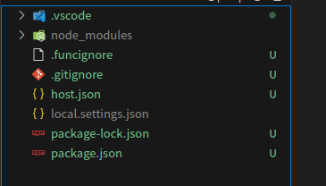
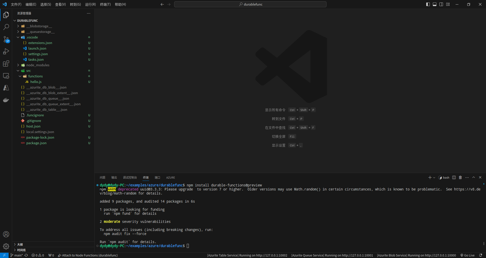
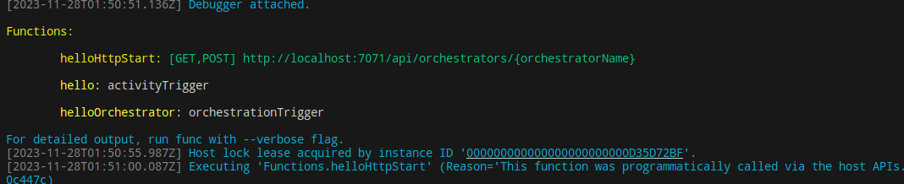
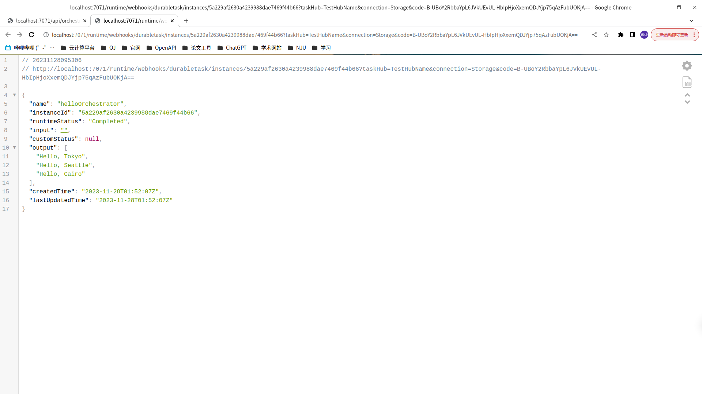
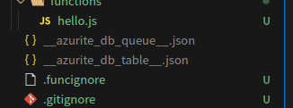
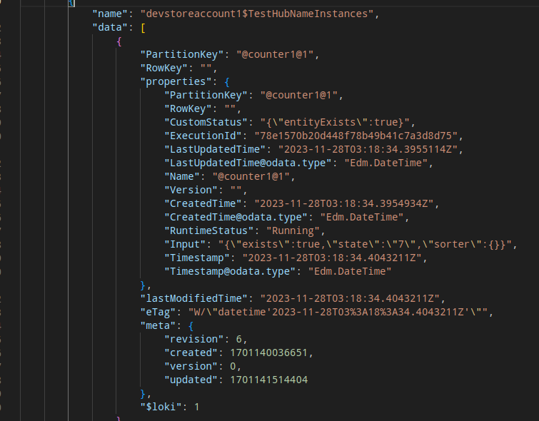

# Azure Functions & Durable Functions

# 环境搭建

## 快速开始

- 前置条件
  - VSCode 安装
  - Azure Function 的 VSCode 插件安装
  - Azure Function Core Tools 下载
  - NodeJS 18 以上

### Azure Function Code Tools 下载

1. 安装微软的包密钥

```bash
curl https://packages.microsoft.com/keys/microsoft.asc | gpg --dearmor > microsoft.gpg
sudo mv microsoft.gpg /etc/apt/trusted.gpg.d/microsoft.gpg
```

2. 设置源

```bash
sudo sh -c 'echo "deb [arch=amd64] https://packages.microsoft.com/debian/$(lsb_release -rs | cut -d'.' -f 1)/prod $(lsb_release -cs) main" > /etc/apt/sources.list.d/dotnetdev.list'
```

> 需要做一些小小的修改
>
> - 将 20 改为 10，因为我是 debian10 系列的主机
> - apricot 改为 buster

3. 更新源

```bash
sudo apt-get update
```

4. 安装

```bash
sudo apt-get install azure-functions-core-tools-4
```


### 创建本地项目

1. 使用 VSCode 插件创建 New Project
2. 选择一个空文件夹
3. 完成以下设置


4. 创建结果



### 安装 Durable Functions 包

```bash
npm install durable-functions@preview
```

### 创建函数

最基本的 Durable Functions 应用有三类基本的函数

- `Orchestrator function`：描述一个编排其他 functions 的 workflow
- `Activity function`：由 `orchestrator function` 调用，执行工作，可能返回结果
- `Client function`：一个常规的 `Azure Function` 用来启动一个 `orchestrator function`

1. 用 VSCode 创建一个 `function`
2. 完成以下设置


3. 可以在 `src/functions/hello.js` 中看到函数

```bash
const { app } = require('@azure/functions');
const df = require('durable-functions');

const activityName = 'hello';

df.app.orchestration('helloOrchestrator', function* (context) {
    const outputs = [];
    outputs.push(yield context.df.callActivity(activityName, 'Tokyo'));
    outputs.push(yield context.df.callActivity(activityName, 'Seattle'));
    outputs.push(yield context.df.callActivity(activityName, 'Cairo'));

    return outputs;
});

df.app.activity(activityName, {
    handler: (input) => {
        return `Hello, ${input}`;
    },
});

app.http('helloHttpStart', {
    route: 'orchestrators/{orchestratorName}',
    extraInputs: [df.input.durableClient()],
    handler: async (request, context) => {
        const client = df.getClient(context);
        const body = await request.text();
        const instanceId = await client.startNew(request.params.orchestratorName, { input: body });

        context.log(`Started orchestration with ID = '${instanceId}'.`);

        return client.createCheckStatusResponse(request, instanceId);
    },
});
```

在这个例子中

- 创建了一个名字为 `helloOrchestrator` 的编排函数
- 创建了一个叫做 `hello` 的活动函数
- 编排函数编排了多个活动函数
- 添加了一个 `HTTP trigger` 函数来启动编排函数

### 测试函数

#### 本地模拟器

1. 安装 Azurite 插件
2. 启动所有 Azurite 服务



3. F5 运行






4. 存储状态文件



# 相关概念

## 实体函数

实体的行为有点类似于通过消息进行通信的微型服务。 每个实体具有唯一的标识和内部状态（如果存在）。 与服务或对象一样，实体会根据提示执行操作。 执行的操作可能会更新实体的内部状态。 它还可能会调用外部服务并等待响应。 实体使用通过可靠队列隐式发送的消息来与其他实体、业务流程和客户端通信。

其内部存储的有关某个实体示例的信息如下图所示，其中的 `input` 字段



# 实现原理

## 可靠执行

DF 能够确保编排的可靠执行，这是通过使用存储队列来驱动函数的触发以及通过存放执行历史记录来实现的。

### 任务关键类


#### `TaskBase`

所有任务的基类，定义了所有任务的基本状态转移

- 在 `orchestrator` 调用 `callActicity` 函数的时候，其内部会创建 `AtomicTask` 类，该类是 `TaskBase` 的一个子类
- 该类的内部存储了 `task` 的状态 `state`，表明该任务是 `Running`、`Failed` 或者 `Completed`
- 当任务（通常是 `CompoundTask`）调用这个函数时，会判断这个函数是否已经被执行过

```javascript
/**
 * @hidden
 * Notifies this task's parents about its state change.
 */
private propagate(executor?: TaskOrchestrationExecutor): void {
    const hasCompleted = this.state !== TaskState.Running;
    if (hasCompleted && this.parent !== undefined) {
        this.parent.handleCompletion(this, executor);
    }
}
```

#### `DFTask`

该类简单继承了一下 `TaskBase`，增加了函数的回调操作

#### `CompoundTask`

该类继承 `DFTask`，包含了多个 `TaskBase`，也就是维护了多个子任务

### 编排关键类


#### `Orchestrator`

- 负责监听一个编排触发器 `DurableOrchestrationBindingInfo` 以及处理维护一个上下文 `OrchestrationContext`，将结果返回给 `OrchestratorState`
- 处理的最后将上下文等信息交托给 `TaskOrchestrationExecutor` 继续执行

#### `TaskOrchestrationExecutor`

`execute` 函数负责管理一个编排函数的执行，并且通过历史记录进行重播

1. 通过历史记录执行编排函数

```javascript
// Execute the orchestration, using the history for replay
for (const historyEvent of history) {
    this.processEvent(historyEvent);
    if (this.isDoneExecuting()) {
        break;
    }
}
```

2. `processEvent` 函数的主要功能

```javascript
private processEvent(event: HistoryEvent): void {
    const eventType = event.EventType;
    switch (eventType) {
        case HistoryEventType.OrchestratorStarted: {
            ...
        }
        case HistoryEventType.ContinueAsNew: {
           // 清除所有编排的状态
        }
        case HistoryEventType.ExecutionStarted: {
           // 继续执行编排函数
        }
        case HistoryEventType.EventSent: {
           // 更新事件ID
        }
        default:
            // 如果当前事件包含了已完成任务的数据，则将该任务封装成一个值
    }
}
```

3. `tryResumingUserCode` 函数

   1. 如果当前执行的任务还在 `running` 则不能直接执行
   2. 如果整个编排函数执行完成了，则获取其返回值
   3. 如果结果生成器返回了一个 `DFTask`，那么就表示接下来要执行新的函数
   4. 然后编排函数再以递归的方式执行该函数
4. 构建当前的编排状态

```javascript
// Construct current orchestration state
const actions: IAction[][] = this.actions.length == 0 ? [[]] : [this.actions];
const orchestratorState = new OrchestratorState({
    isDone: this.hasCompletedSuccessfully(),
    actions: actions,
    output: this.output,
    error: this.exception?.message,
    customStatus: this.context.customStatus,
    schemaVersion: this.schemaVersion,
});
```

#### `DurableOrchestrationContext`

维护函数流的上下文
