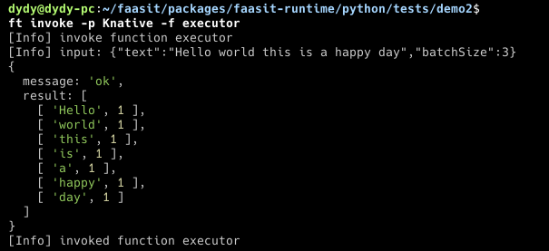

# 基于自建 Knative 的 k8s 集群部署

# 问题背景

Knative（下称 kn）的部署工具极为复杂，其对于 `func` 的部署流程也较为笨重，在 `kn` 中也不支持函数流的部署工作，因此我们需要在自己搭建的原生 k8s 集群上安装 kn，同时我自己编写了一套 kn 的部署工具，可以比原本的部署更加轻便快捷，也在原来的 `kn` 的基础上，增加了对多函数部署的支持。

# 问题定义

## 原生 Knative 部署的问题

kn 提供的函数部署工具 `kn-func` 通过 `func.yaml` 配置文件部署 `kn` 函数，其主要的流程可以概括为

- 从 `gcr` 仓库中拉取对应的镜像
- 将用户编写的代码移动到镜像中，在所拉取的镜像中构建新的镜像
- 将构建好的镜像推送到用户提供的 Docker 仓库中
- 部署 k8s 服务，从 Docker 仓库拉取用户所需要的镜像

以上的部署方式存在以下的问题

- 从 `gcr` 仓库中拉取镜像的过程由于国内的网络问题往往会拉取失败，即便配置了代理也会出现拉取失败的问题
- 重新构建一个镜像的时间过长，而且每次都要重新构建显然是多余的

## Base-Image+Code-Volume

既然一个容器运行只需要用户的代码 + 运行环境，那么其实我们可以先将容器所需的运行环境准备好，然后想个办法将用户的代码打包到容器里头就好。然后我们只需要在 dockerhub 仓库上部署好自己的基础镜像，就可以复用该镜像来实现用户的所有 Serverless 函数。但是这样也会带来另外的一些问题：

- `kn` 服务不支持映射本地的文件到运行时中，因为 `kn` 是运行在集群中的服务，而不是单个主机上的服务

  - 因此只能用持久化卷（`pv` 和 `pvc`）的方式来实现上传代码的功能
- `kn` 服务不支持挂载在可读可写的持久化卷上，但是我们既要将用户的代码打包上去又要有下载功能

# 解决方案

## k8s 集群环境准备

由于我们用的是自建的 k8s 集群，因此不再直接通过 `kn quickstart` 插件安装 `kn` 服务

### 先决条件

- k8s 版本 v1.27
  - 已经安装了 `kubeadm`，`kubelet`，`kubectl`

### 实现步骤

- 启动集群

```bash
sudo kubeadm init
```

- 安装 `serving-crds.yaml`

```bash
wget https://github.com/knative/serving/releases/download/knative-v1.12.4/serving-crds.yaml
kubectl apply -f serving-crds.yaml
```

- 配置 `serving-core.yaml`

```bash
wget https://github.com/knative/serving/releases/download/knative-v1.12.4/serving-core.yaml
kubectl apply -f serving-core.yaml
```

- 配置网络

```bash
wget https://github.com/knative/net-kourier/releases/download/knative-v1.12.3/kourier.yaml
kubectl apply -f kourier.yaml
```

- 配置 `kn` 的 `ingress`

```bash
kubectl patch configmap/config-network 
--namespace knative-serving 
--type merge 
--patch '{"data":{"ingress-class":"kourier.ingress.networking.knative.dev"}}'
```

- 配置域名

```bash
kubectl apply -f https://github.com/knative/serving/releases/download/knative-v1.12.4/serving-default-domain.yaml
```

- 随便拿一个 IP 作为服务

```bash
# 10.0.0.233 is an arbitary choice.EXTERNAL_IP="10.0.0.233"# To get rid of the strange rules that default urls *.svc.cluster.local cannot be accessed from outside network. # sslip can avoid us from trouble of manipulating DNS record.
kubectl patch configmap/config-domain \--namespace knative-serving \--type merge \--patch "{\"data\":{\"$EXTERNAL_IP.sslip.io\":\"\"}}"

kubectl patch svc kourier -n kourier-system -p "{\"spec\": {\"type\": \"LoadBalancer\", \"externalIPs\": [\"$EXTERNAL_IP\"]}}"
```

- 验证外部 IP

```bash
kubectl --namespace kourier-system get service kourier
```

## 持久化卷的部署

通过创建 pv 以及 pvc 来部署持久化卷

```yaml
apiVersion: v1
kind: PersistentVolume
metadata:
  name: faasit-code-volume
spec:
  capacity:
    storage: 1Gi
  volumeMode: Filesystem
  accessModes:
    - ReadWriteOnce
  persistentVolumeReclaimPolicy: Retain
  storageClassName: ""
  hostPath:
    path: # 随便拿一个目录
---
apiVersion: v1
kind: PersistentVolumeClaim
metadata:
  name: faasit-code-volume-claim
spec:
  resources:
    requests:
      storage: 512Mi
  volumeMode: Filesystem
  accessModes:
    - ReadWriteOnce
```

## 文件分发管理器

使用 Nginx 服务作为文件分发的管理器

### 构建 Nginx 镜像

```dockerfile
FROM nginx:alpine

RUN rm /etc/nginx/conf.d/default.conf

COPY ./nginx.conf /etc/nginx/conf.d/default.conf

RUN mkdir -p /data/uploads

EXPOSE 80
```

其中配置文件如下，我也想做成一个纯 Nginx 服务器的，我也不知道为啥文件死活上传不上去

```
server {
    listen       80;
    server_name  localhost;

    location / {
        root   /usr/share/nginx/html;
        index  index.html index.htm;
    }

    # # 配置文件上传的处理
    # location /data/uploads {
    #     # 将客户端上传的文件保存在这个目录
    #     alias /data/uploads;
    #     # 限制上传文件的大小
    #     client_max_body_size 100M;
    #     # 启用 WebDAV 方法
    #     dav_methods PUT DELETE MKCOL COPY MOVE;
    #     # 自动创建目录
    #     create_full_put_path on;
    #     # 设置正确的权限
    #     dav_access user:rw group:rw all:rw;

    #     # 文件上传完成后，重定向或返回成功信息
    #     return 201 "Upload completed";
    # }

    # 提供文件下载的目录
    location /data {
        alias /data;
        autoindex on;  # 开启索引，方便直接浏览文件
    }
}
```

然后执行

```bash
docker build -t docker.io/xdydy/faasit-file-server:v1
docker push docker.io/xdydy/faasit-file-server:v1
```

### 部署 Nginx 服务

```yaml
apiVersion: apps/v1
kind: Deployment
metadata:
  name: nginx-file-server
spec:
  replicas: 1
  selector:
    matchLabels:
      app: nginx-file-server
  template:
    metadata:
      labels:
        app: nginx-file-server
    spec:
      volumes:
      - name: data-volume
        persistentVolumeClaim:
          claimName: faasit-code-volume-claim
      containers:
      - name: nginx
        image: docker.io/xdydy/faasit-file-server:v1
        imagePullPolicy: Always
        ports:
        - containerPort: 80
        volumeMounts:
        - name: data-volume
          mountPath: /data/uploads
        resources:
          requests:
            cpu: 100m
            memory: 128Mi
          limits:
            cpu: 250m
            memory: 256Mi
---
apiVersion: v1
kind: Service
metadata:
  name: nginx-file-server
spec:
  type: ClusterIP
  ports:
  - port: 80
    targetPort: 80
  selector:
    app: nginx-file-server
```

## 构建运行时环境镜像

以 python 运行时为例，由于容器里头没有用户提交的代码，于是我们可以在应用程序启动时，从 Nginx 服务上获取相应的代码文件

```python
import zipfile
def check_and_load_code():
    if not os.path.exists(f'/{codeDir}/{codeName}.py'):
        # 不使用代理下载代码，是一个zip，解压后放到指定目录
        code_url = f"http://10.102.131.24:80/data/uploads/{downLoadFile}"
        r = requests.get(code_url, stream=True, proxies={'http': None, 'https': None})
        with open('/tmp/code.zip', 'wb') as f:
            for chunk in r.iter_content(chunk_size=1024):
                if chunk:
                    f.write(chunk)
        with zipfile.ZipFile('/tmp/code.zip', 'r') as z:
            z.extractall('/code')
```

在镜像中，我们开启一个 `HTTP` 服务器响应用户的请求

```python
@app.route('/', methods=['POST', 'GET'])
async def local_invoke():
    try :
        req = request.get_json()
        logger.info(f"[INPUT] {req}")

        # 导入用户代码
        check_and_load_code()
        code = importlib.import_module(codeName)
        result = await code.handler(req)
        logger.info(f"[OUTPUT] {result}")

        resp = jsonify(result)
        return resp
    except Exception as e:
        logger.error(f"[ERROR] {e}")
        return make_response(jsonify({'error': str(e)}), 500)
```

k8s 容器还需要服务提供一个就绪探针，用来让 k8s 知道服务已经就绪，于是我们随便写点代码让他返回就行

```python
@app.route('/health')
def health():
    return jsonify({'status': 'ok'})
```

在该环境下，我们提供了 `faasit-runtime` 作为一系列运行环境的支撑，在 python 环境下，我们构建 python 的运行时容器

```dockerfile
FROM python:3.10

WORKDIR /app

COPY ./src /app
COPY ./requirements.txt /app/requirements.txt
COPY ./faasit-runtime /faasit-runtime

RUN pip install --upgrade pip

# RUN pip install -r requirements.txt
RUN pip install "flask[async]"

RUN pip install -e /faasit-runtime

RUN mkdir -p /code && cd /code

WORKDIR /code

ENV FAASIT_PROVIDER local

CMD [ "bash" ]
```

构建，推送

```dockerfile
docker build -t docker.io/xdydy/faasit-python-runtime:0.0.1
docker push docker.io/xdydy/faasit-python-runtime:0.0.1
```

## Knative 服务部署

使用 `kn` 的 API 部署 `kn` 服务的示例配置如下

```yaml
apiVersion: serving.knative.dev/v1
kind: Service
metadata:
  name: # 函数名称
  namespace: default
spec:
  template:
    spec:
      containers:
        - image: docker.io/xdydy/faasit-python-runtime:0.0.1 # 前文准备的镜像
          ports:
            - containerPort: 9000 # 内部服务暴露的端口
          readinessProbe: # 就绪探针
            httpGet:
              path: /health
              port: 9000
            initialDelaySeconds: 5
            periodSeconds: 10
            timeoutSeconds: 1
            successThreshold: 1
            failureThreshold: 3
          securityContext: # 安全策略，也是kn麻烦的地方
            runAsNonRoot: false
            allowPrivilegeEscalation: false
            capabilities:
              drop:
                - ALL
            seccompProfile:
              type: RuntimeDefault
          env:
            - name: FAASIT_FUNC_NAME
              value: split
            - name: FAASIT_PROVIDER
              value: knative
            - name: FAASIT_CODE_DIR
              value: wordcount-split.zip
            - name: FAASIT_WORKFLOW_NAME
              value: wordcount
          command: # 容器启动命令
            - python
          args:
            - /app/server.py
```

至于容器里头的代码，可以通过 `kubectl cp` 命令将本地的代码文件拷贝过去，可以通过一个简单的命令来查找运行文件分发器的 `pod`

```bash
pod=kubectl get pod | grep nginx-file-server | awk '{print $1}'
kubectl cp code.zip $(pod):/data/uploads
```

这样函数就部署完成了

```bash
kubectl get ksvc

# NAME                 URL                                                     LATESTCREATED              LATESTREADY                READY   REASON
# wordcount-count      http://wordcount-count.default.10.0.0.233.sslip.io      wordcount-count-00001      wordcount-count-00001      True
# wordcount-executor   http://wordcount-executor.default.10.0.0.233.sslip.io   wordcount-executor-00001   wordcount-executor-00001   True
# wordcount-sort       http://wordcount-sort.default.10.0.0.233.sslip.io       wordcount-sort-00001       wordcount-sort-00001       True
# wordcount-split      http://wordcount-split.default.10.0.0.233.sslip.io      wordcount-split-00001      wordcount-split-00001      True
```

也支持调用


