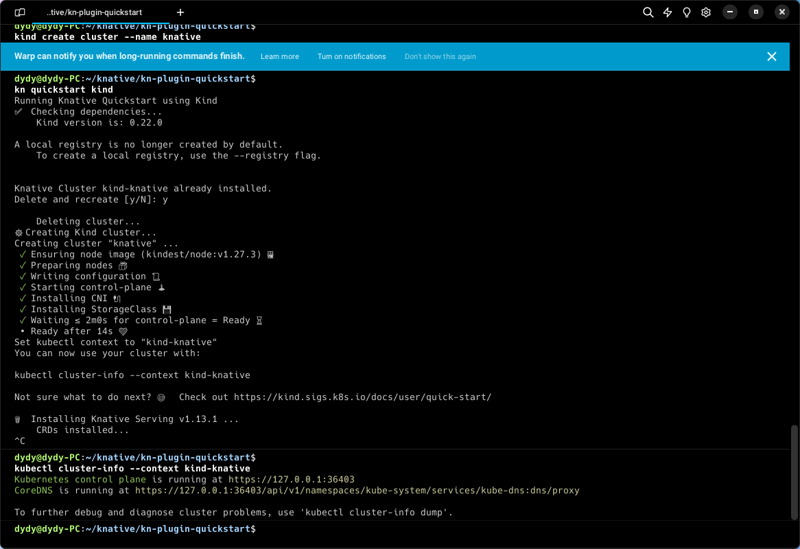
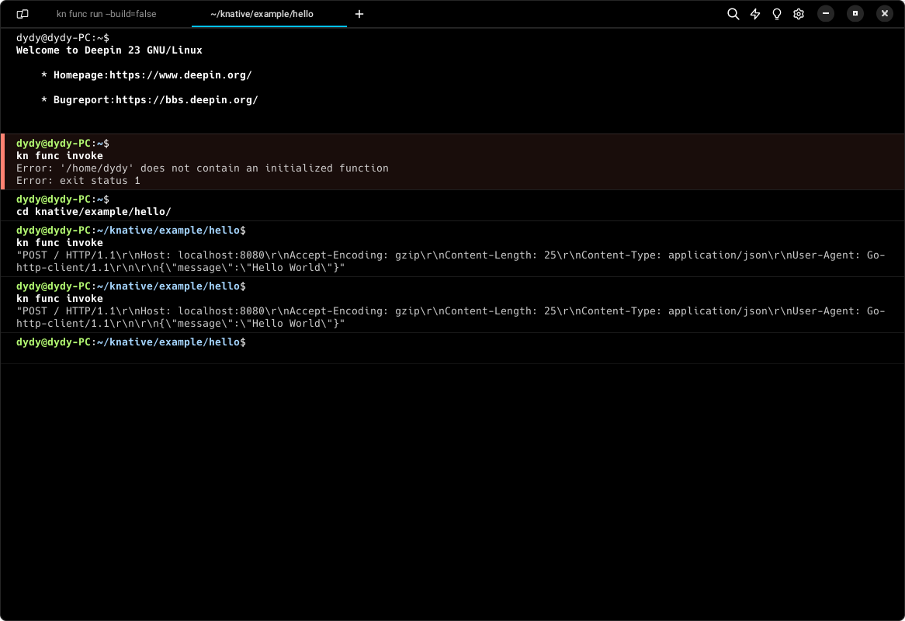

# Knative 学习笔记

# 安装

## 先决条件

- 有 `kind`（kubernetes in docker）
- 有 `kubectl`

## Knative CLI 安装

- 源码安装
  - 先决条件：有 `Go`
  - 克隆仓库

  ```bash

    git clone git@github.com:knative/client.git
    cd client/
    ```
	- 构建二进制执行文件
	```bash
    hack/build.sh -f
    ```

- 将二进制文件移动到路径下
```bash
sudo mv kn /usr/local/bin
```
- 校验版本
```bash
kn version
```

## Knative quickstart 插件安装

- 源码安装
  - 克隆仓库

  ```bash
    git clone git@github.com:knative-extensions/kn-plugin-quickstart.git
    ```
	- 构建源码
	```bash
    ./hack/build.sh
    ```

- 移动
```bash
sudo mv kn-quickstart /usr/local/bin
```
- 校验
```bash
kn quickstart --help
```

### 运行 Knative quickstart 插件

- 安装 k8s 实例
- 创建一个集群名字为 `knative`

```bash
kind create cluster --name knative
```

- 安装 `Knative Serving`
- 安装 `Knative Eventing`
- 本地部署

```bash
kn quickstart kind --registry
```



### Knative Functions

#### 安装 func CLI

- 源码安装
  - 克隆仓库

  ```bash
    git clone git@github.com:knative/func.git
    ```
  - 编译
	```bash
    cd  func && make
    ```

#### 作为 Knative 的插件安装

- 移动到系统目录

```bash
sudo mv ./func /usr/local/bin/kn-func
```

- 验证

```bash
kn func version
```


## 从K8S安装Knative

### K8S搭建

- 启动集群

```bash
sudo kubeadm init
```


### Knative-serving 安装

- 配置 `serving-crds.yaml`
```bash
wget https://github.com/knative/serving/releases/download/knative-v1.12.4/serving-crds.yaml
kubectl apply -f serving-crds.yaml
```
- 配置 `serving-core.yaml`
```bash
wget https://github.com/knative/serving/releases/download/knative-v1.12.4/serving-core.yaml
kubectl apply -f serving-core.yaml
```

- 配置网络

  - 使用 kourier
    ```bash
    wget [https://github.com/knative/net-kourier/releases/download/knative-v1.12.3/kourier.yaml](https://github.com/knative/net-kourier/releases/download/knative-v1.12.3/kourier.yaml)
    kubectl apply -f kourier.yaml

    # Configure Knative Serving to use Kourier by default by running the command:

    kubectl patch configmap/config-network 
    --namespace knative-serving 
    --type merge 
    --patch '{"data":{"ingress-class":"kourier.ingress.networking.knative.dev"}}'

    kubectl apply -f https://github.com/knative/serving/releases/download/knative-v1.12.4/serving-default-domain.yaml

    # 10.0.0.233 is an arbitary choice.
    EXTERNAL_IP="10.0.0.233"

    # To get rid of the strange rules that default urls *.svc.cluster.local cannot be accessed from outside network. 
    # sslip can avoid us from trouble of manipulating DNS record.
    kubectl patch configmap/config-domain \
      --namespace knative-serving \
      --type merge \
      --patch "{\"data\":{\"$EXTERNAL_IP.sslip.io\":\"\"}}"

    kubectl patch svc kourier -n kourier-system -p "{\"spec\": {\"type\": \"LoadBalancer\", \"externalIPs\": [\"$EXTERNAL_IP\"]}}"

    # Fetch the External IP address or CNAME by running the command:

    kubectl --namespace kourier-system get service kourier

    ```
	- 使用istio
	```bash
    wget https://github.com/knative/net-istio/releases/download/knative-v1.12.3/istio.yaml
    kubectl apply -l knative.dev/crd-install=true -f istio.yaml
    kubectl apply -f istio.yaml

    # Install the Knative Istio controller by running the command:
    wget https://github.com/knative/net-istio/releases/download/knative-v1.12.3/net-istio.yaml
    kubectl apply -f net-istio.yaml

    # Fetch the External IP address or CNAME by running the command:
    kubectl --namespace istio-system get service istio-ingressgateway
    ```

### 问题

#### 无法对外暴露 IP

- 当前解决方案

```bash
kubectl get svc -n kourier-system

# 
# NAME               TYPE           CLUSTER-IP      EXTERNAL-IP   PORT(S)                      AGE
# kourier            LoadBalancer   10.106.92.238   <pending>     80:31491/TCP,443:31283/TCP   23m
# kourier-internal   ClusterIP      10.109.2.63     <none>        80/TCP,443/TCP               23m
```

```bash
curl -v --noproxy '*' -H "Host: nodehello.default.example.com" http://10.106.92.238:80
```

- 解决方案2.0

```bash
# 10.0.0.233 is an arbitary choice.
EXTERNAL_IP="10.0.0.233"

# To get rid of the strange rules that default urls *.svc.cluster.local cannot be accessed from outside network. 
# sslip can avoid us from trouble of manipulating DNS record.
kubectl patch configmap/config-domain \
      --namespace knative-serving \
      --type merge \
      --patch "{\"data\":{\"$EXTERNAL_IP.sslip.io\":\"\"}}"

kubectl patch svc kourier -n kourier-system -p "{\"spec\": {\"type\": \"LoadBalancer\", \"externalIPs\": [\"$EXTERNAL_IP\"]}}"
```

## 

## 问题解决

### 代理问题

在国内环境下安装 knative serving 时需要通过代理，但是在 `http_proxy` 中设置为 `http://127.0.0.1:7890` 并不能够正确的将其设置为本机的代理，因为在 docker 环境下它读到的 127.0.0.1 并不知道是啥。需要设置为一个域名代理 `proxy.i2ec.top:21087`，通过内网 IP 或者公网 IP 设置代理

安装过程中可以通过

```bash
kubectl get pods -n knative-serving
```

判断 `knative-serving` 是否被正确添加

但是在部署函数完成后要想成功调用函数，又需要对生成的域名做绕过代理的处理，例如现在生成了一个

```bash
http://hello.default.127.0.0.1.sslip.io/
```

使用 `curl` 工具时需要绕过代理访问

> 可以为 no_proxy 添加 `.sslip.io` 作为一个小技巧

# 入门

## Functions

### 创建一个函数

```bash
kn func create -l go hello
```

### 构建运行部署函数

- 运行

```bash
kn func run
```

- 触发

```bash
kn func invoke
```



- 部署

部署一个函数创建一个 OCI 容器镜像，并将该镜像 push 到镜像仓库中

```bash
kn func deploy --registry <>
```

# Serving

## 创建一个 Service

- 先决条件

## 从私有仓库部署
