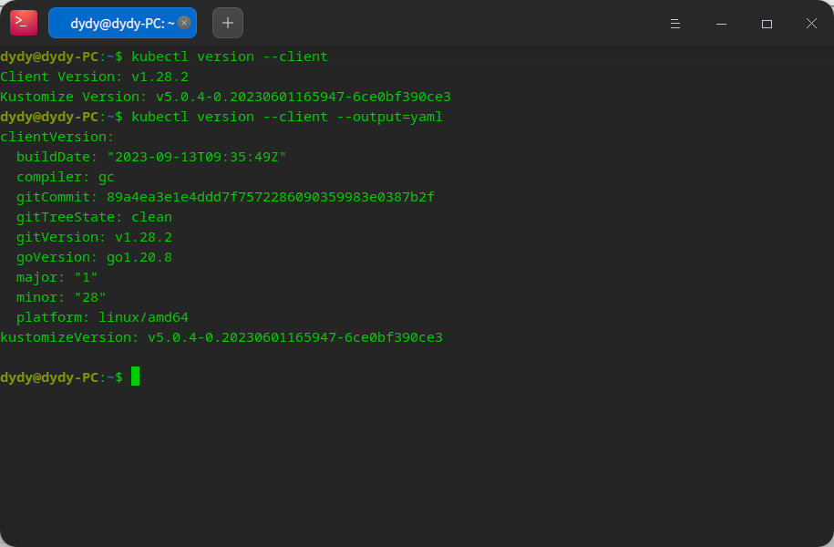
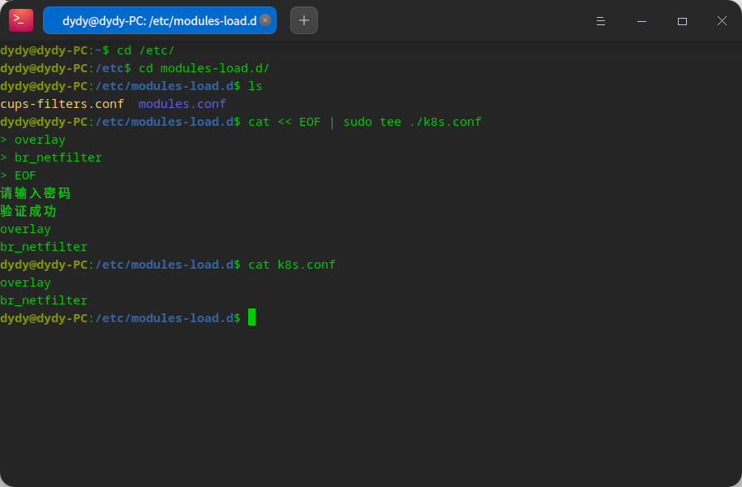
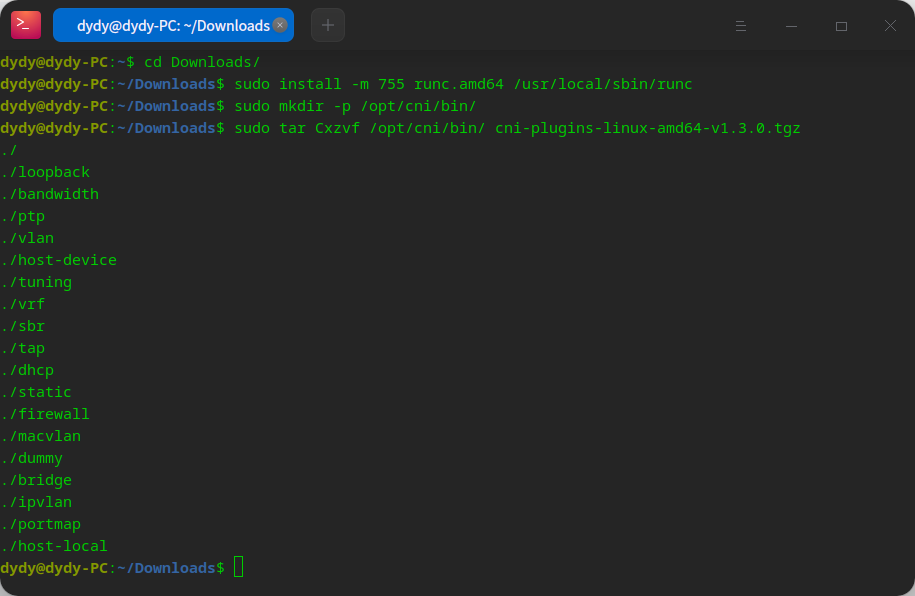
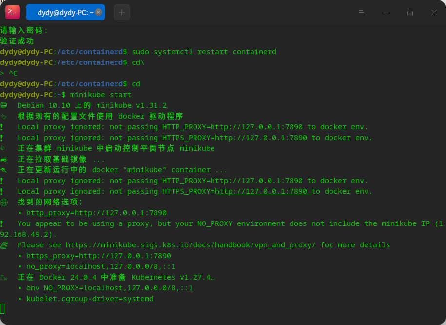
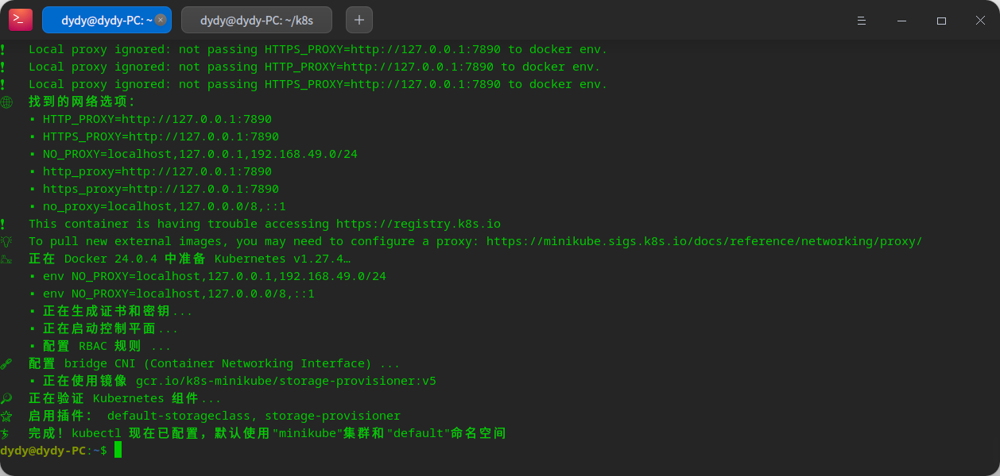
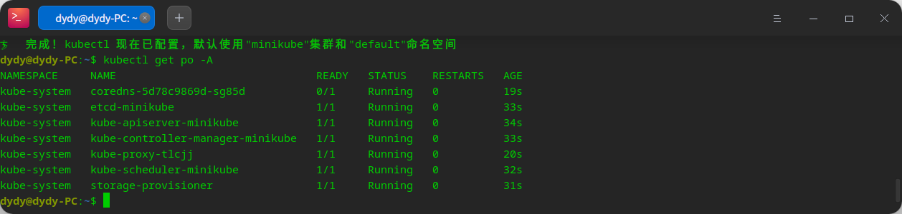
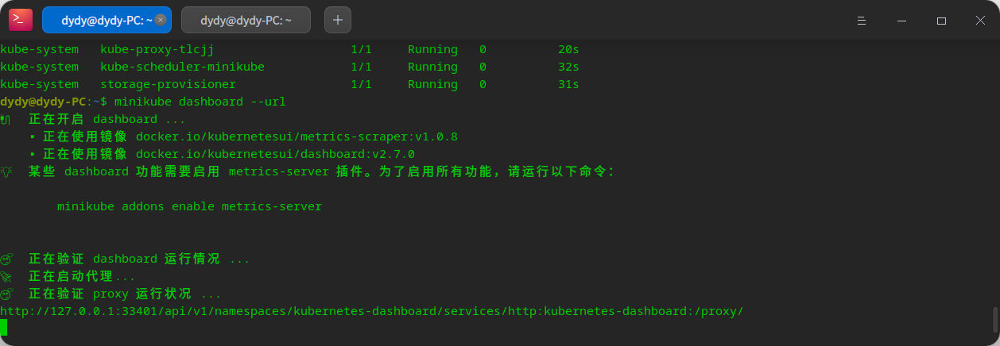
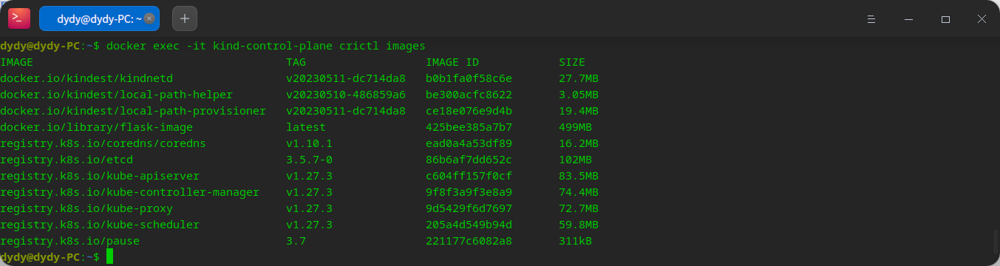

# Kubernetes 概述

- k8s 官网：[https://kubernetes.io/](https://kubernetes.io/)

Kubernetes 又被叫做 k8s，是一个用于自动化部署、自动扩容以及容器化应用管理的开源系统

# `kubernetes` 搭建

使用阿里云的镜像构建 k8s

```bash
sudo apt-get update && sudo apt-get install -y apt-transport-https
curl https://mirrors.aliyun.com/kubernetes/apt/doc/apt-key.gpg | sudo apt-key add -
```


之后将阿里云的镜像地址写到 sources.list 当中

```bash
sudo vim /etc/apt/sources.list.d/kubernetes.list

# 写入下列内容
deb https://mirrors.aliyun.com/kubernetes/apt/ kubernetes-xenial main
```

退出后更新软件包，下载 k8s

```bash
sudo apt-get update
sudo apt-get install -y kubelet kubeadm kubectl
```

# `kubernetes` 工具搭建

通过上述流程其实已经安装好了 `kubelet`、`kubeadm` 以及 `kubectl`。如果没有安装就参照下列文档

## `kubectl`

### `kubectl` 安装

kubectl 是一个能够在 k8s 集群中运行命令的工具

1. 下载最新的 `kubectl` 发行版

```bash
curl -LO "https://dl.k8s.io/release/$(curl -L -s https://dl.k8s.io/release/stable.txt)/bin/linux/amd64/kubectl"
```

1. 验证 `kubectl`

```bash
curl -LO "https://dl.k8s.io/$(curl -L -s https://dl.k8s.io/release/stable.txt)/bin/linux/amd64/kubectl.sha256"
echo "$(cat kubectl.sha256)  kubectl" | sha256sum --check
```


1. 安装 kubectl

由于我不想安装在根目录中（考虑到系统应当保持对普通用户的最小权限），因此将 `kubectl` 安装为普通用户模式

```bash
mkdir -p ~/.local/bin/
mv ./kubectl ~/.local/bin/
```

1. 验证 `kubectl`

```bash
kubectl version --client

kubectl version --client --output=yaml
```



### `kubectl` 配置

为了使得 `kubectl` 能够找到并且感知一个 k8s 集群，它需要一个 `kubeconfig file`，其在使用 `kube-up.sh` 创建一个集群或者成功部署一个 `Minikube` 集群的时候会自动创建。默认情况下，`kubeconfig` 配置会放在 `~/.kube/config`

1. 通过集群的状态可以检查 `kubectl` 是否已经配置

```bash
kubectl cluster-info
```

## `kubeadm`

### 配置 CA 证书

1. 下载 `easyrsa3`

```bash
curl -LO https://dl.k8s.io/easy-rsa/easy-rsa.tar.gz
tar xzf easy-rsa.tar.gz
cd easy-rsa-master/easyrsa3
./easyrsa init-pki
```

1. 生成一个新的 CA

```bash
./easyrsa --batch "--req-cn=${MASTER_IP}@`date +%s`" build-ca nopass
```

1. 生成服务器证书和密钥

```bash
./easyrsa --subject-alt-name="IP:${MASTER_IP},"\
"IP:${MASTER_CLUSTER_IP},"\
"DNS:kubernetes,"\
"DNS:kubernetes.default,"\
"DNS:kubernetes.default.svc,"\
"DNS:kubernetes.default.svc.cluster,"\
"DNS:kubernetes.default.svc.cluster.local" \
--days=10000 \
build-server-full server nopass
```

1. 拷贝 `pki/ca.crt`, `pki/issued/server.crt`, and `pki/private/server.key` 到特定目录.

```bash
dydy@dydy-PC:~/Downloads/easy-rsa-master/easyrsa3/pki$ sudo cp ./ca.crt /etc/kubernetes/pki/ca.crt
dydy@dydy-PC:~/Downloads/easy-rsa-master/easyrsa3/pki$ sudo cp ./private/ca.key /etc/kubernetes/pki/ca.key
```

## `kubelet`

### [通过配置文件设置](https://kubernetes.io/docs/tasks/administer-cluster/kubelet-config-file/) `kubelet` [参数](https://kubernetes.io/docs/tasks/administer-cluster/kubelet-config-file/)

1. 创建配置文件

我们在 `kubelet` 看得到的地方创建一个配置文件，以下是一个示例

```yaml
apiVersion: kubelet.config.k8s.io/v1beta1
kind: KubeletConfiguration
address: "192.168.0.8"
port: 20250
serializeImagePulls: false
evictionHard:
    memory.available:  "200Mi"
```

1. 通过配置文件启动进程

# `kubernetes` 容器运行时(container runtimes)

本章节主要讲述了设置结点的相关任务

主要的安装软件包括

- `containerd`
- `CRI-O`
- `Docker Engine`
- `Mirantis Container Runtime`

## 安装前准备

1. 转发 IPV4 并且让 `iptables` 能够看到桥接流量

```bash
cd /etc/modules-load.d/
cat << EOF | sudo tee ./k8s.conf
```



```bash
sudo modprobe overlay
sudo modprobe br_netfilter

# sysctl params required by setup, params persist across reboots
cat <<EOF | sudo tee /etc/sysctl.d/k8s.conf
net.bridge.bridge-nf-call-iptables  = 1
net.bridge.bridge-nf-call-ip6tables = 1
net.ipv4.ip_forward                 = 1
EOF
# Apply sysctl params without rebootsudo sysctl --system

sudo sysctl --system
```


验证 `br_netfilter` 以及 `overlay` 模块是否已经被加载

```bash
lsmod | grep br_netfilter
lsmod | grep overlay
```


验证 `net.bridge.bridge-nf-call-iptables`, `net.bridge.bridge-nf-call-ip6tables`, and `net.ipv4.ip_forward` 这些系统变量都被设置为 1

```bash
sysctl net.bridge.bridge-nf-call-iptables net.bridge.bridge-nf-call-ip6tables net.ipv4.ip_forward
```


## `cgroup` 驱动

在 Linux 系统下，控制组（`control groups`）被用来管理附加在进程上的资源

`kubelet` 以及我们所需要安装的工具都需要通过实现 `control groups` 来促使 `pods & containers` 的资源管理以及设置资源限制。为了通过 `control groups` 实现，`kubelet` 以及容器运行时需要使用 `cgroup drivers`。需要强调的是 `kubelet` 以及容器运行时使用的是相同的 `cgroup` 驱动以及拥有着相同的配置

- `cgroupfs`
- `systemd`

### `cgroupfs` 驱动

`cgroupfs driver` 是默认的 `kubelet cgroup` 驱动。通过使用 `cgroupfs` 驱动，`kubelet` 以及容器运行时就可以直接实现 `cgroup` 文件系统来配置 `cgroups`

`cgroups` 驱动在 `systemd` 已经在系统最开始就安装的情况下是不推荐的，因为 `systemd` 希望系统中只有一个单独的 `cgroup` 管理者

### `systemd` `cgroup` 驱动

前面我们提到，当系统初始化时已经使用了 `systemd` 作为系统资源的管理者时，便不再使用 `cgroupfs`，否则系统将会有两个不同的资源管理器，带来的后果如下

> Two `cgroup` managers result in two views of the available and in-use resources in the system. In some cases, nodes that are configured to use `cgroupfs` for the kubelet and container runtime, but use `systemd` for the rest of the processes become unstable under resource pressure.

因此当 `systemd` 在系统初始化时已经被用于管理系统资源，我们使用 `systemd` 作为 `kubelet` 以及容器运行时的 `cgroup` 驱动。

为了将 `systemd` 设置为 `cgroup` 驱动，通过编辑 `KubeletConfiguration` 选项来设置

```yaml
apiVersion: kubelet.config.k8s.io/v1beta1
kind: KubeletConfiguration
...
cgroupDriver: systemd
```

### 将 `systemd` 驱动迁移至 `kubdeam` 管理的集群

本章节主要介绍如何通过默认的 `systemd` 驱动建立不同的容器运行时

#### 配置 `kubelet` 的 `cgroup` 驱动

`kubeadm` 允许用户在使用 `kubeadm init` 时传入一个 `kubeletConfiguration` 数据结构。这个结构可以包括 `cgroupDriver` 字段来控制 `kubelet` 的 `cgroup` 驱动

一个最简单的配置字段的例子

```yaml
# kubeadm-config.yaml
kind: ClusterConfiguration
apiVersion: kubeadm.k8s.io/v1beta3
kubernetesVersion: v1.21.0
---
kind: KubeletConfiguration
apiVersion: kubelet.config.k8s.io/v1beta1
cgroupDriver: systemd
```

可以通过以下的启动命令进行传递

```bash
kubeadm init --config kubeadm-config.yaml
```

## 容器运行时

### `containerd`

> **FAQ**: For Kubernetes, do I need to download `cri-containerd-(cni-)<VERSION>-<OS-<ARCH>.tar.gz` too?
> **Answer**: No.
> As the Kubernetes CRI feature has been already included in `containerd-<VERSION>-<OS>-<ARCH>.tar.gz`, you do not need to download the `cri-containerd-....` archives to use CRI.
> The `cri-containerd-...` archives are [deprecated](https://github.com/containerd/containerd/blob/main/RELEASES.md#deprecated-features), do not work on old Linux distributions, and will be removed in containerd 2.0.
>
> ...非常抽象

1. 安装 `containerd`

通过<u>[https://github.com/containerd/containerd/releases](https://github.com/containerd/containerd/releases)</u> 下载对应版本的 `containerd` 并解压

```bash
sudo tar Cxzvf /usr/local/ containerd-1.6.24-linux-amd64.tar.gz
```


**systemd**

为了使用 `systemd` 启动 `containerd`，我们应该通过 [https://raw.githubusercontent.com/containerd/containerd/main/containerd.service](https://raw.githubusercontent.com/containerd/containerd/main/containerd.service) 下载配置文件到 `/usr/local/lib/systemd/system`

```bash
dydy@dydy-PC:/usr/local/lib/systemd/system$ curl https://erd/main/containerd.service | sudo tee /usr/local/lib/systemd/system/containerd.service
```

然后运行命令

```bash
systemctl daemon-reload
systemctl enable --now containerd
```


1. 安装 `runc`

从 [https://github.com/opencontainers/runc/releases](https://github.com/opencontainers/runc/releases) 下载二进制文件，然后执行安装

```bash
sudo install -m 755 runc.amd64 /usr/local/sbin/runc
```

1. 安装 CNI 插件

从 [https://github.com/containernetworking/plugins/releases](https://github.com/containernetworking/plugins/releases) 下载二进制文件

```bash
sudo mkdir -p /opt/cni/bin/
sudo tar Cxzvf /opt/cni/bin/ cni-plugins-linux-amd64-v1.3.0.tgz
```



安装完成后，会在 `/etc/containerd/config.toml` 当中看到配置

```yaml
#   Copyright 2018-2022 Docker Inc.

#   Licensed under the Apache License, Version 2.0 (the "License");
#   you may not use this file except in compliance with the License.
#   You may obtain a copy of the License at

#       http://www.apache.org/licenses/LICENSE-2.0

#   Unless required by applicable law or agreed to in writing, software
#   distributed under the License is distributed on an "AS IS" BASIS,
#   WITHOUT WARRANTIES OR CONDITIONS OF ANY KIND, either express or implied.
#   See the License for the specific language governing permissions and
#   limitations under the License.

disabled_plugins = ["cri"]

#root = "/var/lib/containerd"
#state = "/run/containerd"
#subreaper = true
#oom_score = 0

#[grpc]
#  address = "/run/containerd/containerd.sock"
#  uid = 0
#  gid = 0

#[debug]
#  address = "/run/containerd/debug.sock"
#  uid = 0
#  gid = 0
#  level = "info"
```

然后将默认的配置文件写入

```bash
containerd config default | sudo tee /etc/containerd/config.toml
```

为了在配置里头通过 `runc` 使用 `systemd` `cgroup` 驱动，进行如下设置


然后重启 `containerd`

```bash
sudo systemctl restart containerd
```

### `CRI-O`

### `Docker Engine`

### `Mirantis Container Runtime`

# `kubernetes` 部署运行

## [Hello Minikube](https://kubernetes.io/docs/tutorials/hello-minikube/)

1. 事先准备
   1. 建立 `minikube`
      1. 下载安装

```bash
curl -LO https://storage.googleapis.com/minikube/releases/latest/minikube-linux-amd64
sudo install minikube-linux-amd64 /usr/local/bin/minikube
```

1. 启动集群

```bash
minikube start
```

报错

> You appear to be using a proxy, but your NO_PROXY environment does not include the minikube IP (192.168.49.2)





1. 与集群交互通信

```shell
kubectl get po -A
```



```bash
minikube dashboard --url
```



1. 创建一个部署

```bash
kubectl create deployment hello-node --image=registry.k8s.io/e2e-test-images/agnhost:2.39 -- /agnhost netexec --http-port=8080

kubectl get deployments
```

## [kind](https://kind.sigs.k8s.io/docs/user/quick-start/#installing-from-release-binaries)

1. 下载二进制包

```bash
[ $(uname -m) = x86_64 ] && curl -Lo ./kind https://kind.sigs.k8s.io/dl/v0.20.0/kind-linux-amd64

sudo chmod +x ./kind
sudo mv ./kind /usr/local/bin/
```

1. `kind` 创建集群

```bash
kind create cluster
```


1. 观测集群

```bash
kubectl cluster-info --context kind-kind
```


1. 关闭集群

```bash
kind delete cluster
```


## [通过](https://kubernetes.io/docs/setup/production-environment/tools/kubeadm/create-cluster-kubeadm/) `kubeadm` [创建一个集群](https://kubernetes.io/docs/setup/production-environment/tools/kubeadm/create-cluster-kubeadm/)

- 资源需求
  - 一台以上能跑 deb/rpm 包的 Linux 系统
  - 2G 以上的 RAM 空闲
  - 在任意一个控制结点上至少有 2 个 CPU
  - 网络通畅的环境下

**部署流程**

1. 准备 hosts

在所有的网络主机上安装容器运行时 [Kubernetes](https://yxrt3ryg3jg.feishu.cn/docx/Xru9d9V7MoSk5kxsFJXcqtUjn2c#MphRdOe5woWWRkxItl8c2fqrnHg)

1. 准备需要的容器镜像（可选）
2. 初始化控制节点(control-plane node)

控制结点意味着其是作为控制组件的机器运行的，其包括 `etcd`（集群数据库）以及 `API Server`（用于 `kubectl` 与集群的通信）

```bash
kubeadm init
```

# Kind

## 在集群中加载镜像

在一个已经运行的集群中加载一个 `docker-image`，`dockerfile` 如下

```dockerfile
FROM ubuntu:latest

COPY ${pwd}/code /code

RUN apt update && apt install -y python3-pip && apt-get clean

RUN pip install flask

CMD [ "sh", "-c", "python3 /code/app.py"]
```

`code` 里头运行了一个简单的 `flask` 应用

```python
from flask import Flask

app = Flask(__name__)

@app.route("/")
def hello_world():
    return "<p>Hello World!</p>"

if __name__ == "__main__":
    app.run(host="0.0.0.0",port=8080,debug=True)
```

加载到集群中

```bash
kind load docker-image flask-image:latest
```


```shell
docker exec -it kind-control-plane crictl images
```



# 问题

## `kubeadm init`

```bash
[WARNING Hostname]: hostname "dydy-pc" could not be reached
[WARNING Hostname]: hostname "dydy-pc": lookup dydy-pc on 210.28.129.251:53: no such host
```

修改 `/etc/hosts`，将 `localhost` 后面添加自己的电脑主机地址即可

```bash
[ERROR CRI]: container runtime is not running: output: time="2023-09-19T09:03:23+08:00" level=fatal msg="validace connection: CRI v1 runtime API is not implemented for endpoint \"unix:///var/run/containerd/containerd.sock\": rpc error: code = Unimplemented desc = unknown service runtime.v1.RuntimeService"
```

[Kubernetes 环境搭建](https://yxrt3ryg3jg.feishu.cn/docx/Xru9d9V7MoSk5kxsFJXcqtUjn2c#part-RfVPd1aHPoNdExx7ppqcVT9Gn6f)

## `kubeadm config images pull`

```bash
failed to pull image "registry.k8s.io/kube-apiserver:v1.28.2": output: E0919 09:32:01.239971   35982 remote_image.go:171] "PullImage from image service failed" err="rpc error: code = Unavailable desc = connection error: desc = \"transport: Error while dialing dial unix /var/run/containerd/containerd.sock: connect: permission denied\"" image="registry.k8s.io/kube-apiserver:v1.28.2"
time="2023-09-19T09:32:01+08:00" level=fatal msg="pulling image: rpc error: code = Unavailable desc = connection error: desc = \"transport: Error while dialing dial unix /var/run/containerd/containerd.sock: connect: permission denied\""
, error: exit status 1
```

生成默认配置文件

```bash
kubeadm config print init-defaults > init.default.yaml
```

修改默认配置文件
