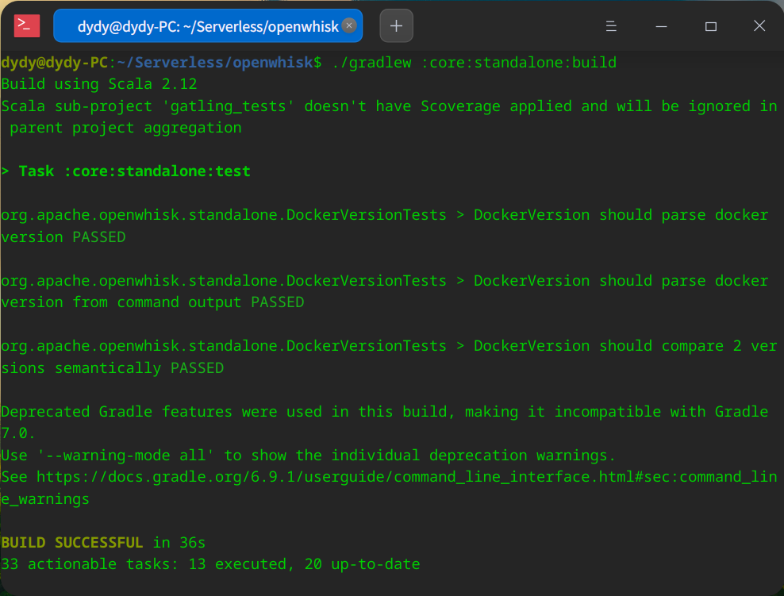
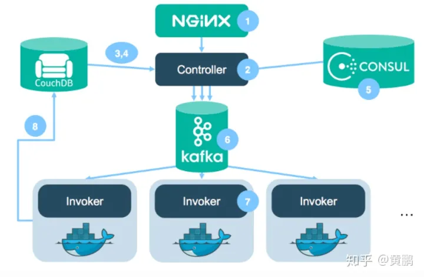

# OpenWhisk概述

Openwhisk是属于Apache基金会的开源Faas计算平台，由IBM在2016年公布并贡献给开源社区。IBM Cloud本身也提供完全托管的OpenWhisk Faas服务IBM Cloud Function。从业务逻辑来看，OpenWhisk同AWS Lambda一样，为用户提供基于事件驱动的无状态的计算模型，并直接支持多种编程语言。

OpenWhisk特点：
- 高性能，高扩展性的分布式FaaS计算平台
- 函数的代码及运行时全部在Docker容器中运行，利用Docker engine实现FaaS函数运行的管理、负载均衡、扩展.
- OpenWhisk所有其他组件(如：API网关，控制器，触发器等)也全部运行在 Docker容器中。这使得OpenWhisk全栈可以很容易的部署在任意IaaS/PaaS平台上。
- 相比其他FaaS实现(比如OpenFaaS)，OpenWhisk更像是一套完整的Serverless 解决方案，除了容器的调用和函数的管理，OpenWhisk 还包括了用户身份验证/鉴权、函数异步触发等功能。

目前支持的语言: `Nodejs`, `Python`, `Java`, `php`, `Ruby`, `Go`, `Rust`, `dotnet`, `Ballerina`, `blackBoxes`。

# OpenWhisk环境搭建

## 安装Java

deepin上安装Java的方式

```bash
sudo apt-get install default-jre
sudo apt-get install default-jdk
安装nodejs
#下载Node.js安装包
wget https://nodejs.org/dist/v10.15.3/node-v10.15.3-linux-x64.tar.xz
#解压文件
tar xvf node-v10.15.3-linux-x64.tar.xz
#移动到相应目录下
mv ./node-v10.15.3-linux-x64 ./node
mv ./node /opt/node
#添加环境变量
cd 
vim .bash_profile
#node
export PATH=$PATH:/opt/node/bin
```

## 编译openwhisk

```bash
# git clone下来
git clone https://github.com/apache/incubator-openwhisk.git openwhisk
# 切换到openwhisk目录，运行下面命令
$ ./gradlew :core:standalone:build
```





## 配置OpenWhisk Cli工具

```bash
- github下载网址：https://link.zhihu.com/?target=https%3A//github.com/apache/openwhisk-cli 下载二进制文件
# 上传到服务器解压, 解压
# 设置API HOST
wsk property set --apihost http://172.17.0.1:3233
# 设置auth
wsk property set --auth 789c46b1-71f6-4ed5-8c54-816aa4f8c502
# 可以通过以下命令获取当前的auth
wsk property get --auth
```


## 配置Docker
https://cloud.tencent.com/developer/article/1753250

1. 卸载旧版本残留

```bash
sudo apt-get remove docker.io docker-engine
```
2. 下载并安装密钥

```bash
curl -fsSL https://mirrors.ustc.edu.cn/docker-ce/linux/debian/gpg | sudo apt-key add -
```
3. 检查是否安装成功

```bash
sudo apt-key fingerprint 0EBFCD88
```


4. 在source.list中添加docker-ce的软件源

```bash
sudo deepin-editor /etc/apt/sources.list.d/docker.list # 使用 deepin 默认的编辑器新建并打开 docker.list 文件
# 写入一条内容如下：
deb [arch=amd64] https://mirrors.ustc.edu.cn/docker-ce/linux/debian buster stable # 这里 buster 是 debain 版本的代号，deepin20 是debain10 代号为 buster，编辑完成后保存
注意： 使用 cat /etc/debian_version 查看自己的 debain 版本。
```

5. 更新仓库

```bash
sudo apt update
```


6. 安装docker

```bash
sudo apt install docker-ce docker-ce-cli containerd.io
```
7. 验证


1. 管理启动项

```bash
sudo apt install chkconfig 
# 列出所有启动项
sudo chkconfig
# chkconfig --help 查看帮助命令

sudo chkconfig --del docker
```

## 启动

在openwhisk的bin目录下会有相应的可执行文件


```bash
java -jar openwhisk-standalone.jar
```


如果docker需要管理员权限就加个sudo


服务起来后设置提示的命令:设置apihost和auth

```bash
wsk property set --apihost 'http://172.17.0.1:3233' --auth '23bc46b1-71f6-4ed5-8c54-816aa4f8c502:123zO3xZCLrMN6v2BKK1dXYFpXlPkccOFqm12CdAsMgRU4VrNZ9lyGVCGuMDGIwP'
```


# OpenWhisk包下载

## Catalog包

```bash
git clone https://github.com/apache/openwhisk-catalog
cd openwhisk-catalog
#将一些变量添加进来
vim ~/.bashrc

#openwhisk
OPENWHISK_HOME=~/Serverless/openwhisk
WSK=$OPENWHISK_HOME/bin
CLI_PATH=$OPENWHISK_HOME/bin/wsk
API_HOST=http://172.17.0.1:3233
AUTH=789c46b1-71f6-4ed5-8c54-816aa4f8c502:abczO3xZCLrMN6v2BKK1dXYFpXlPkccOFqm12CdAsMgRU4VrNZ9lyGVCGuMDGIwP
export OPENWHISK_HOME CLI_PATH API_HOST API_KEY
export PATH=$PATH:$WSK


#在本地standalone运行时下载包
./packages/installCatalogUsingWskdeploy.sh $AUTH $API_HOST $CLI_PATH
#然后验证
wsk package list /whisk.system
```


# OpenWhisk couchDB数据库配置

1. 依次执行以下3条命令

```bash
sudo apt update && sudo apt install -y curl apt-transport-https gnupg
curl https://couchdb.apache.org/repo/keys.asc | gpg --dearmor | sudo tee /usr/share/keyrings/couchdb-archive-keyring.gpg >/dev/null 2>&1source /etc/os-release
echo "deb [signed-by=/usr/share/keyrings/couchdb-archive-keyring.gpg] https://apache.jfrog.io/artifactory/couchdb-deb/ ${VERSION_CODENAME} main" \| sudo tee /etc/apt/sources.list.d/couchdb.list >/dev/null
```

2. 执行后你可以在`/etc/apt/source.list.d`里头看到`couchdb.list`文件，用`vim`打开，将里头的`apricot`改为`buster`，因为原来那个在网站上的资源没有了T_T
3. 之后更新源后下载couchdb

```bash
sudo apt update
sudo apt install couchdb
```
4. 新建一个文件夹后在里头导出一些环境变量

```bash
mkdir logconf && cd logconf
vim wsk_env.sh
export OW_DB=CouchDB
export OW_DB_USERNAME=openwhisk
export OW_DB_PASSWORD=openwhisk
export OW_DB_PROTOCOL=http
export OW_DB_HOST=127.0.0.1
export OW_DB_PORT=4444
export OPENWHISK_TMP_DIR=~/Serverles/logconf
```
5. 之后进行ansible安装

```bash
source openwsk_env.sh
cd ansible
ansible-playbook -i environments/local setup.yml
```


# OpenWhisk内部流程
 



1. 面向用户的REST API(Nginx)：OpenWhisk通过Nginx 接收函数触发和函数的CRUD请求。
2. 控制器(Controller): 真正处理请求的地方。
3. CouchDB(身份验证和鉴权):控制器首先需要验证用户的身份和权限。用户的身份信息保存在CouchDB的用户身份数据库中。验证无误后，控制器进行下一步处理。
4. CouchDB: 确认用户的身份后，控制器需要从 CouchDB中读取将要被触发的action。action对应的数据存储在CouchDB的whisk 数据库，主要包含要被执行的代码、默认参数、被执行代码的权限等。
5. Consul和负载均衡:控制器已经有了触发函数所需要的全部信息，在将数据发送给触发器(Invoker)之前，控制器需要和Consul确认，从Consul 获取处于空闲状态的触发器的地址。Consul 是一个开源的服务注册/发现系统，在 OpenWhisk中Consul负责记录跟踪所有触发器的状态信息。当控制器向Consul发出请求，Consul从后台随机选取一个空闲的触发器信息，并返回。
6. 触发请求送进Kafka: Kafka 充当了Controller和Invoker之间的缓存，当后端 Invoker 负载过大，没有及时处理Kafka数据流中的请求时，Controller 依然可以将请求送入Kafka，无需阻塞当前线程。同时所有送进Kafka 的请求消息都会被以log的形式的形式保存在文件系统中，即使系统瘫痪，已经由 Controller发出的请求也不会丢失。
7. 触发器运行用户代码: 触发器从对应的 Kafka topic 中接收控制器传来的请求，并执行响应代码。OpenWhisk 的触发器是构建在 Docker 之上的，每一个函数触发都运行在一个独立的 Docker 容器之内.
8. CouchDB 保存运行结果: 触发器执行结果最终会被保存在 CouchDB 中的 whisk 数据库里

# 参考链接

[openwhisk配置流程](https://blog.csdn.net/weixin_51971301/article/details/121436849)
[bbs-go-site](https://mlog.club/article/5772204)
[1.1. Installation on Unix-like systems ‒ Apache CouchDB® 3.2 Documentation](https://docs.couchdb.org/en/latest/install/unix.html#installation-using-the-apache-couchdb-convenience-binary-packages)
