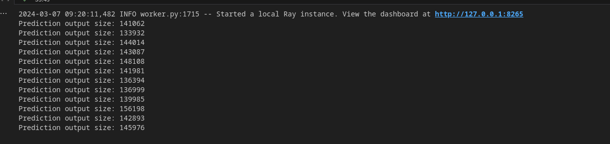
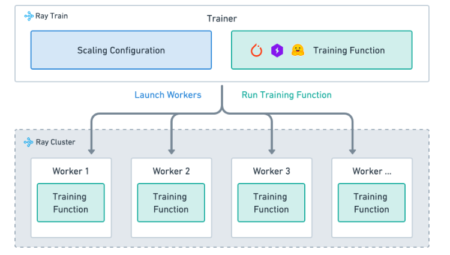
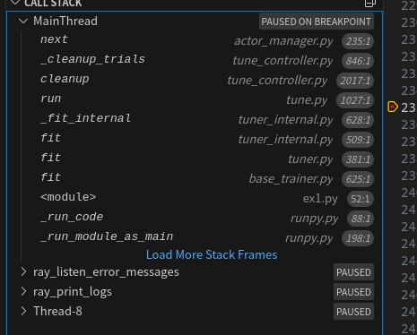
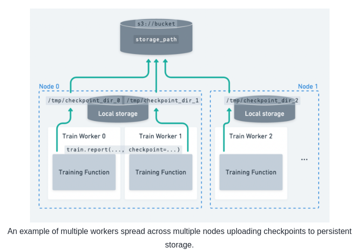

# Ray 学习笔记

# Ray 概述

Ray 是一个用于扩展 AI 和 Python 应用程序（如机器学习）的开源统一框架。它提供了并行处理的计算层，因此您无需成为分布式系统专家。Ray 通过以下组件，最小化了运行分布式个体和端到端机器学习工作流的复杂性：

- 为常见的机器学习任务（如数据预处理、分布式训练、超参数调整、强化学习和模型服务）提供可扩展的库。
- 用于并行化和扩展 Python 应用程序的 Pythonic 分布式计算基元。
- 用于与现有工具和基础设施（如 Kubernetes、AWS、GCP 和 Azure）集成和部署 Ray 集群的集成工具和实用程序。

对于数据科学家和机器学习从业者来说，Ray 让您无需基础设施专业知识就能扩展作业：

- 轻松地在多个节点和 GPU 上并行化和分布 ML 工作负载。
- 利用 ML 生态系统，具有原生和可扩展的集成。

对于 ML 平台构建者和 ML 工程师，Ray：

- 提供了创建可扩展且健壮的 ML 平台的计算抽象。
- 提供了简化上手和与更广泛的 ML 生态系统集成的统一 ML API。
- 通过使相同的 Python 代码能够从笔记本电脑无缝扩展到大型集群，减少了开发与生产之间的摩擦。

对于分布式系统工程师，Ray 自动处理关键过程：

- 编排——管理分布式系统的各种组件。
- 调度——协调任务执行的时间和地点。
- 容错——确保任务完成，不管不可避免的故障点。
- 自动扩展——根据动态需求调整分配的资源数量。

# Ray 安装

```bash
pip install -U "ray[data,train,tune,serve]"
```

# Ray 核心组件

- Ray Core：提供了一些核心组件构造可扩展的分布式应用
- Ray Data：一个可扩展的用户 ML 训练的数据处理库
- Ray Train：一个可扩展的 ML 训练库，用于支撑分布式训练以及参数微调

  - 可扩展：将模型从单一机器扩展到集群
  - 抽象性：忽略了分布式计算的复杂性
  - 适用方面：大模型以及大型数据集
- Ray Tune：用于参数微调
- Ray Serve：一个可扩展的模型服务库，用于构建在线推理 API
- Ray RLlib：一个用于强化学习（RL）的库
- Ray Clusters：一系列连接着 Ray head node 的 worker 节点，集群可扩展

## Ray Core

### 关键概念

- Task：无状态的 Worker

  - Ray 允许任意的函数在分离的 python worker 上执行
  - 可以明确资源需求（CPUs, GPUs）
- Actor：有状态的 Worker

  - 可以让函数访问其对应的 worker 的变量
  - 也可以明确资源需求
- Object：Task 以及 Worker 都是在 Object 上计算的

  - 可以在任意的 Ray 集群中存储
  - 可以被引用
  - 远程 Object 被缓存在 Ray 的分布式共享内存存储中
- Placement Groups：允许用户管原子性地管理组资源

  - 可以计划 Ray 的 Task 以及 Actor

### 编程模型

#### `remote` 函数

```python
@ray.remote
```

`./_private/worker.py`

```python
@PublicAPI
def remote(
    *args, **kwargs
) -> Union[ray.remote_function.RemoteFunction, ray.actor.ActorClass]:
    # "callable" returns true for both function and class.
    if len(args) == 1 and len(kwargs) == 0 and callable(args[0]):
        # This is the case where the decorator is just @ray.remote.
        # "args[0]" is the class or function under the decorator.
        return _make_remote(args[0], {})
    assert len(args) == 0 and len(kwargs) > 0, ray_option_utils.remote_args_error_string
    return functools.partial(_make_remote, options=kwargs)
```

`./_private/worker.py`

```python
def _make_remote(function_or_class, options):
    if not function_or_class.__module__:
        function_or_class.__module__ = "global"

    if inspect.isfunction(function_or_class) or is_cython(function_or_class):
        ray_option_utils.validate_task_options(options, in_options=False)
        return ray.remote_function.RemoteFunction(
            Language.PYTHON,
            function_or_class,
            None,
            options,
        )

    if inspect.isclass(function_or_class):
        ray_option_utils.validate_actor_options(options, in_options=False)
        return ray.actor._make_actor(function_or_class, options)

    raise TypeError(
        "The @ray.remote decorator must be applied to either a function or a class."
    )
```

`./remote_function.py`

```python
class RemoteFunction:
    def __init__(
        self,
        language,
        function,
        function_descriptor,
        task_options,
    ):
        ...
        # Override task.remote's signature and docstring
        @wraps(function)
        def _remote_proxy(*args, **kwargs):
            return self._remote(args=args, kwargs=kwargs, **self._default_options)

        self.remote = _remote_proxy
```

因此对于 `remote` 装饰器的请求，其内部流程大体如下

- `remote` 函数接收类或者函数作为参数
- `_make_remote` 函数将其封装为类 `RemoteFunction`
- `RemoteFunction` 里头有 `self.remote` 属性，存放传入的函数 `f`
- `f.remote` 调用原来的方法

### 示例

#### 基于 Task 的批量预测

通过 Ray 的 Task，可以构建一个批处理预测程序，大概分为三个步骤

- 加载模型
- 部署 Ray Task，每一个 Task 包含了模型以及共享的输入数据集
- 每一个 worker 都在被分配的分片上执行预测，并输出结果

假设我们有这样一个简单的模型

```python
import pandas as pd
import numpy as np

def load_model():
    # A dummy model.
    def model(batch: pd.DataFrame) -> pd.DataFrame:
        # Dummy payload so copying the model will actually copy some data
        # across nodes.
        model.payload = np.zeros(100_000_000)
        return pd.DataFrame({"score": batch["passenger_count"] % 2 == 0})
    
    return model
```

为每个 worker 分配 Task

```python
import pyarrow.parquet as pq
import ray

@ray.remote
def make_prediction(model, shard_path):
    df = pq.read_table(shard_path).to_pandas()
    result = model(df)

    # Write out the prediction result.
    # NOTE: unless the driver will have to further process the
    # result (other than simply writing out to storage system),
    # writing out at remote task is recommended, as it can avoid
    # congesting or overloading the driver.
    # ...

    # Here we just return the size about the result in this example.
    return len(result)
```

驱动程序负责管理所有的 Tasks

```python
# 12 files, one for each remote task.
input_files = [
        f"s3://anonymous@air-example-data/ursa-labs-taxi-data/downsampled_2009_full_year_data.parquet"
        f"/fe41422b01c04169af2a65a83b753e0f_{i:06d}.parquet"
        for i in range(12)
]

# ray.put() the model just once to local object store, and then pass the
# reference to the remote tasks.
model = load_model()
model_ref = ray.put(model)

result_refs = []

# Launch all prediction tasks.
for file in input_files:
    # Launch a prediction task by passing model reference and shard file to it.
    # NOTE: it would be highly inefficient if you are passing the model itself
    # like make_prediction.remote(model, file), which in order to pass the model
    # to remote node will ray.put(model) for each task, potentially overwhelming
    # the local object store and causing out-of-disk error.
    result_refs.append(make_prediction.remote(model_ref, file))

results = ray.get(result_refs)

# Let's check prediction output size.
for r in results:
    print("Prediction output size:", r)
```




#### 基于 Actor 的批量预测

上述基于 Tasks 的批量预测算法中，每个 Task 必须从驱动节点获取模型才能开启预测，如果模型很大这将是一个很大的开销。我们通过 Ray Actor 的方式，只需要加载一次模型就能够复用

```python
import pandas as pd
import pyarrow.parquet as pq
import ray

@ray.remote
class BatchPredictor:
    def __init__(self, model):
        self.model = model
        
    def predict(self, shard_path):
        df = pq.read_table(shard_path).to_pandas()
        result =self.model(df)

        # Write out the prediction result.
        # NOTE: unless the driver will have to further process the
        # result (other than simply writing out to storage system),
        # writing out at remote task is recommended, as it can avoid
        # congesting or overloading the driver.
        # ...

        # Here we just return the size about the result in this example.
        return len(result)
```

构造函数只会在每个 Worker 被调用一次，我们使用 `ActorPool` 库来接收预测请求

```python
from ray.util.actor_pool import ActorPool

model = load_model()
model_ref = ray.put(model)
num_actors = 4
actors = [BatchPredictor.remote(model_ref) for _ in range(num_actors)]
pool = ActorPool(actors)
input_files = [
        f"s3://anonymous@air-example-data/ursa-labs-taxi-data/downsampled_2009_full_year_data.parquet"
        f"/fe41422b01c04169af2a65a83b753e0f_{i:06d}.parquet"
        for i in range(12)
]
for file in input_files:
    pool.submit(lambda a, v: a.predict.remote(v), file)
while pool.has_next():
    print("Prediction output size:", pool.get_next())
```

### 思考

- 对于大模型的加载，应当传递的是模型引用而不是模型本身，`ray` 提供了 `ray.put(model)` 传递模型引用

```python
# GOOD: the model will be stored to driver's object store only once
model = load_model()
model_ref = ray.put(model)
for file in input_files:
    make_prediction.remote(model_ref, file)

# BAD: the same model will be stored to driver's object store repeatedly for each task
model = load_model()
for file in input_files:
    make_prediction.remote(model, file)
```

## Ray Train

- 训练函数：包含了训练逻辑的 Python 代码
- Worker：一个运行了训练函数的进程
- 可扩展配置：对于 Worker 的配置以及计算资源的配置
- 训练器：将上述三个概念打包起来构建一个分布式训练任务



### 编程模型

#### Trainer

`trainer` 会构建一个 `TorchTriainer`，当调用 `trainer.fit` 的时候，会构建 `Actor` 自动部署；其实在 `dataset` 的时候也部署了一个 `Actor`



从调用堆栈可以看出，最后会调用到 `actor_manager.py`。

经过我花费了 2 个小时的分析，其训练器训练函数的大体流程如下：

```python
# main.py
trainer.fit()

# base_trainer.py
class BaseTrainer(abc.ABC):
    def fit(self) -> Result:
        ...
        try:
            **result_grid = tuner.fit()**
        except:
            ...
        result = result_grid[0]
        return result
        
# ray/tune/tuner.py
class Tuner:
    def fit(self) -> ResultGrid:
        ...
**        return self._local_tuner.fit()**

# ray/tune/impl/tuner_internal.py
class TunerInternal:
    def fit(self) -> ResultGrid:
**        analysis = self._fit_internal(trainable, param_space)**
        return ResultGrid(analysis)
        
    def _fit_internal(self, trainable: TrainableType, param_space: Optional[Dict[str,Any]] -> ExperimentAnalysis:
        ...
        analysis = run(**args)
        return analysis
        
# ray/tune/tune.py
def run():
    ...
    try:
        while not runner.is_finished() and not experiment_interrupted_event.is_set():
            **runner.step()**
            if has_verbosity(Verbosity.V1_EXPERIMENT):
                _report_progress(runner, progress_reporter)

            if air_verbosity is not None:
                _report_air_progress(runner, air_progress_reporter)
    except Exception:
        runner.cleanup()
        raise
    ...
    
 # ray/tune/execution/tune_controller.py
 class TuneController:
     def step(self):
        ...
        # Start actors for added trials
        self._maybe_add_actors()

        # Handle one event
        **if not self._actor_manager.next(timeout=0.1):**
            # If there are no actors running, warn about potentially
            # insufficient resources
            if not self._actor_manager.num_live_actors:
                self._insufficient_resources_manager.on_no_available_trials(
                    self.get_trials()
                )

        ...
        
# ray/air/execution/_internal/actor_manager.py
class RayActorManager:
    def next(self, timeout: Optional[Union[int, float]] = None) -> bool:
        ...

        # We always try to start actors as this won't trigger an event callback
        self._try_start_actors()

        ...
        self._try_start_actors()
        return True
        
    def _try_start_actors(self, max_actors: Optional[int] = None) -> int:
        ...
                # Start Ray actor
                **actor = remote_actor_cls.remote(**kwargs)**

                ...

        return started_actors

# ray/actor.py
class ActorClass:
    def options(self, **actor_options):
        class ActorOptionWrapper:
            def remote(self, *args, **kwargs):
                return actor_cls._remote(args=args, kwargs=kwargs, **updated_options)
```

### 示例

#### 数据加载与预处理

Ray Train 集成了用于数据加载与预处理的库。

数据迁移可以通过以下四个基本步骤执行

- 创建一个 Ray 数据集
- 预处理 Ray 数据集
- 将预处理好的 Ray 数据集输入到 Ray Train 训练器中
- 通过 `Train Function` 消费数据集

```python
import torch
import ray
from ray import train
from ray.train import Checkpoint, ScalingConfig
from ray.train.torch import TorchTrainer

# Set this to True to use GPU.
# If False, do CPU training instead of GPU training.
use_gpu = False

# Step 1: Create a Ray Dataset from in-memory Python lists.
# You can also create a Ray Dataset from many other sources and file
# formats.
train_dataset = ray.data.from_items([{"x": [x], "y": [2 * x]} for x in range(200)])

# Step 2: Preprocess your Ray Dataset.
def increment(batch):
    batch["y"] = batch["y"] + 1
    return batch

train_dataset = train_dataset.map_batches(increment)

def train_func(config):
    batch_size = 16

    # Step 4: Access the dataset shard for the training worker via
    # ``get_dataset_shard``.
    train_data_shard = train.get_dataset_shard("train")
    train_dataloader = train_data_shard.iter_torch_batches(
        batch_size=batch_size, dtypes=torch.float32
    )

    for epoch_idx in range(1):
        for batch in train_dataloader:
            inputs, labels = batch["x"], batch["y"]
            assert type(inputs) == torch.Tensor
            assert type(labels) == torch.Tensor
            assert inputs.shape[0] == batch_size
            assert labels.shape[0] == batch_size
            break # Only check one batch. Last batch can be partial.

# Step 3: Create a TorchTrainer. Specify the number of training workers and
# pass in your Ray Dataset.
# The Ray Dataset is automatically split across all training workers.
trainer = TorchTrainer(
    train_func,
    datasets={"train": train_dataset},
    scaling_config=ScalingConfig(num_workers=2, use_gpu=use_gpu)
)
result = trainer.fit()
```

#### 配置持久化存储

Ray Train 运行会生成报告指标、检查点和其他工件的历史记录。您可以将它们配置为保存到持久存储位置。



持久化存储能够

- 做标记点以及容错：从持久化存储系统保存标记可以从上一次节点故障的检查点恢复
- 实验后分析：存储所有试验数据的统一位置对于实验后分析非常有用，例如在集群终止后访问最佳检查点和超参数配置
- 通过下游服务和批量推理任务桥接训练/微调：您可以轻松访问模型和工件以与其他人共享或在下游任务中使用它们。

#### 保存加载检查点

Ray Train 提供了一个快照训练过程的进程

- 储存性能最后的模型比重：将模型保存到持久化存储中
- 容错：让长时运行工作从节点错误中恢复
- 分布式检查点：当进行模型并行训练时，Ray Train 检查点提供了一个简单的方法用于更新模型分片，而不是将整个模型集中到单节点
- 与 Ray Tune 集成

# Ray 系统架构

## 全局控制存储（GCS）

### GCS 客户端

#### Accessor

- ActorInfoAccessor：访问 Actor 的信息
- JobInfoAccessor：访问 Job 的信息
- NodeInfoAccessor：访问工作节点的信息
- NodeResourceInfoAccessor：访问工作节点资源的信息
- ErrorInfoAccessor：访问错误信息
- TaskInfoAccessor：访问任务信息
- WorkerInfoAccessor：访问 Worker 的信息
- PlacementGroupInfoAccessor：访问工作组的信息
- InternalKVAccessor：内部 KV 访问

#### GlobalStateAccessor

### GCS 服务端

### 发布订阅模型

## 分级部署调度器

## 分布式对象存储
