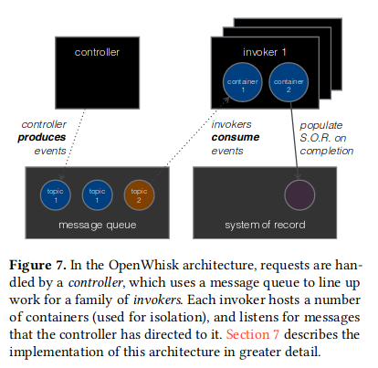
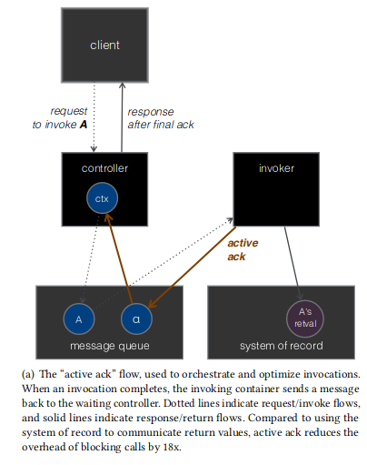
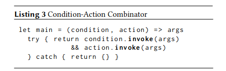
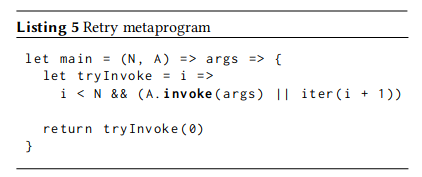

# Serverless 函数编排

# 系统目标

- 构建一套基于事件驱动的有限状态机模型的函数编排系统，可以编排不同云平台上的 Serverless 函数
  - 异构平台的标准化
    - 支持不同云平台函数的运行时
    - 支持不同云平台的事件处理
  - 高效执行
    - 基于事件驱动的有限状态机模型
    - 函数并行度优化
  - 简单部署
    - 前端：函数式编程
    - 中端：Workflow 静态图
    - 后端：运行时组件

# 模型构建

## 有限状态机模型

使用有限状态机管理触发器

## 事件抽象

事件作为外部输入关系触发器

## 函数流

# 参考文献

## [Triggerflow: Trigger-based orchestration of serverless workflows](https://www.sciencedirect.com/science/article/pii/S0167739X21001989)

### 解决问题

现有的云编排系统要么专注于短期运行的工作流程，要么为同步大规模并行作业带来相当大的开销。没有能够对自定义工作流进行可扩展拦截以及优化的开放系统

- 短期运行：IBM Composer、Amazon Step Functions Express Workflows
- 大开销：Azure Durable Functions、Amazon Step Functions

### 工作难点

- 通过 CEP 规则执行业务流程

  - CEP：Complex Event Processing
- 使用触发器做服务工作流编排是可能的但是往往不理想

  - 有必要为每个步骤创建不同的队列或目录
  - 触发器不能够一直等到前面多个函数的执行结束
  - 触发器不适用于错误处理

### 相关工作

- 利用基于内容的发布/订阅系统中的复合订阅来提供分散的基于事件的工作流程管理 [link.springer.com](https://link.springer.com/chapter/10.1007/11587552_13)
- [serverlessworkflow.io](https://serverlessworkflow.io/) 该工作提出将工作流声明为 YAML 文件，其中包含要使用的 CloudEvents 概述、无服务器函数的事件驱动调用以及工作流数据管理和控制流逻辑的状态转换。

  - 定义了一个可以被不同系统解释的抽象定义，从而保证可移植性避免供应商锁定
- 当下的 Serverless 编排系统大多数依赖于集中式的服务器资源（虚拟机）或者是专有资源

  - 坏处
    - 不能将资源占有量降为 0
    - 工作流执行时编排组件持续活跃，工作流执行时间长时造成资源浪费
- IBM Composer 生成一个状态机代表着即将要被执行的 IBM Cloud Functions

  - 能够表示顺序、条件分支、循环、并行以及任务映射
  - `fork/join` 同步阻塞了外部用户提供的 `Redis` 服务，限制了其对短期运行任务的适用性
- Amazon Step Functions and Amazon Step Functions Express Workflows 使用 JSON 模型化任务转移、选择、等待、并行、映射，ASF 是一个支持 Workflow 错误容忍服务，ASFE 时用户支撑短时运行的工作负载
- 微软的 Azure Durable Functions（ADF）提出了使用代码生成 Workflows 的方式，使用 `async/await` 结构，使用事件源重启被挂起的工作流

  - 不支持映射工作
  - 只包含了 `Task.whenAll` 抽象来实现 `fork/join`
- 谷歌云提供了 Google Cloud Workflows 服务。它的工作流包括了一系列的基于逻辑的步骤，逻辑类似于条件或者循环。可以通过对每一个步骤发出一个 HTTP Request 的方式来触发 Google Cloud Function

  - 不适合用来做广播的并行任务

### 模型定义

- ECA 模型：Event-Condition-Action, `Event Sources` and `Programmable Conditions` and `Actions`

  - 包含触发器和规则：适合定义表示工作流的有限状态机的状态转移
- 触发器服务

  - Workflow: 由 6 元组组成的一个有限状态机
    - 输入事件的集合
    - 上下文变量
    - 将 Actions 映射到 ECA 模型
    - 初始状态
    - 终止状态
    - 状态转移方程，通过 ECA 触发器转移
  - Trigger: 可以看作是状态转移方程，由四元组构成
    - 事件：驱动云应用的院原子信息。使用 subject 字段匹配事件对应的触发器，使用 type 字段描述事件的类型
    - 上下文：一个 key-value 的数据结构，包含了触发器运行周期的状态
    - 条件：由用户定义的决定事件是否匹配行为
    - 行为：用于异步地触发一个 Serverless 函数

  > 触发器的生命周期可以表示如下：
  >
  > 1. 一个事件由某些事件源产生
  > 2. 事件被系统消费，激活对应的触发器
  > 3. 事件由 Condition 函数处理，若结果是正确的，就交由 Action 函数处理
  > 4. Action 函数被激活了，就称作该触发器被 fired
  > 5. 当一个触发器被 fired 的时候，他就可以被 disabled 或者由系统 maintain
  >    - Mapping Workflows to Triggers：一个工作流可以通过一系列触发器进行映射
  >    - 任意工作流抽象都可以通过有限状态机表示，可以被转化为各种各样的触发器，并且通过 TriggerFlow 表示
  >    - Substitution Principle：工作流本身通过初始化和终止遵守操作。工作流可以嵌套
  >    - Dynamic Trigger Interception：

- 错误容忍：
  - 事件总线保证事件的至少一次传递
    - 事件可以重复无序
  - 通过 CloudEvent 标准为每个事件赋予一个 ID
    - 在事件处理阶段，同样 ID 的事件就会丢弃
  - 通过辨别两种事件组合类型来处理无序消息
    - 聚合：如计数器。由于消息顺序不会改变最终结果，故不用考虑
    - 序列：仅仅处理激活序列开头的触发器的事件，其他事件将被延迟，直到启用他们激活的触发器

## [Comparison of FaaS Orchestration Systems](https://ieeexplore.ieee.org/abstract/document/8605772)

### 解决问题

本文章比较了四种函数编排平台 AWS Lambda, IBM Cloud Functions, Google Cloud Functions,Azure Functions

### 相关工作

- IBM Serverless 的三大难题

  - 函数需要在一个沙箱中进行
  - 函数组合应该遵循同步调用的替换原则（即组合也应该是一个函数）
  - 调用不应该重复计费
- 编排函数不需要外部的运行时支持

  - 两种解决模式
    - 使用函数进行编排
      - 函数的编排是在一个 Serverless 函数中进行的
      - 带来双重付费的问题
    - 使用外部的客户端进行编排
      - 能够解决双重付费问题
      - 不能视为函数，违反替换原则

### 评估模型

- ST-safeness：符合三难困境的编排服务被称为 STsafe。
- Programming model：编程简单性和编码抽象集，是否提供反射 API 来观察函数组合的当前状态。
- Parallel execution support：并行执行支持
- State management：数据如何从一个函数转移到下一个函数
- Architecture：编排器是客户端调度程序或者是本身就是一个函数，用于事件的响应
- Overhead：鉴于编排服务对函数调度程序的依赖，应针对代表性函数组合（例如链和并行模式）来衡量编排开销的重要性
- Billing model

### 评估结果

|                               | ST-safeness                  | Programming model                                                                                           | Parallel execution support | State management   | Architecture       | Overhead                 |
| ----------------------------- | ---------------------------- | ----------------------------------------------------------------------------------------------------------- | -------------------------- | ------------------ | ------------------ | ------------------------ |
| Amazon Step Functions (ASF)   | 不满足，因为函数编排不是函数 | - 支持顺序和分支，函数重试以及并行。- 只能静态图- 提供了反射 API 查询状态以及取消执行- 通过 CloudWatch 监控 | 支持                       | 32KB 的限制        | 外部编排器         |                          |
| IBM Composer                  | 满足，也是第一个满足的       | - 提供了完整的编排库- 不提供并行的 DSL- 但是可以将函数作为前端接口暴露- 不支持反射 API，只能通过日志        | 不支持                     | 5MB 的状态转移限制 | 集成在反应式核心中 | 提供了包，支持用户上传包 |
| Azure Durable Functions (ADF) | 满足                         | - 通过 C#代码创建函数流- 提供了反射 API，不仅能获取当前的状态，也能触发事件到一个挂起的函数                 | 支持                       | 不限制             | 外部编排器         | 提供了非常简单的包       |

## [FaaSFlow: enable efficient workflow execution for function-as-a-service](https://dl.acm.org/doi/10.1145/3503222.3507717)

### 解决问题

- 传统的 master-worker 架构性能太差
  - master 的调度模式，通过该模式，功能在 master 节点中触发并分配给工作节点来执行。
  - worker 之间的数据移动也会降低吞吐量。

> These serverless workflow systems usually provide a centralized workflow engine on the master node to manage the workflow execution state and assign function tasks to the worker nodes. We refer to this scheduling pattern as master-side workflow schedule pattern (denoted by MasterSP), as the central workflow engine in the master node determines whether a function task is triggered to run or not
> 
> 这些无服务器工作流系统通常在主节点上提供集中式工作流引擎来管理工作流执行状态并将功能任务分配给工作节点。我们将这种调度模式称为主端工作流调度模式（记为 MasterSP），由主节点中的中央工作流引擎决定是否触发功能任务运行

- 带来的问题
  - 中央工作流引擎负责动态管理和调度所有功能。函数执行状态频繁地从主节点转移到工作节点，带来大量的调度开销。由于函数很短，这种传输会频繁发生。
  - 引擎“随机”将触发的函数分发到工作节点以实现负载均衡，云厂商对函数的输入输出数据大小进行配额，以避免严重消耗网络带宽。在生产无服务器平台中，用户通常依赖额外的数据库存储服务来进行临时数据存储和交付，从而承受巨大的数据移动开销

### 工作难点

- WorkerSP: 大规模工作流划分为控制平面以及数据平面

  - worker 函数可以执行自动缩放并重用热容器，这导致控制平面中的每个功能节点在数据中可能具有多个不同的数据平面
  - 在无服务器工作流的实际控制平面（用户预定义）和数据平面（数据依赖）不一定相同的情况下，将大规模工作流划分为两个不同平面的多个工作人员时具有挑战性
  - 考虑到集群中资源动态变化的前提，还需要一种基于实时资源可用性来划分和调度工作流的机制
- FaaStore: 利用主内存在函数之间交换数据

  - 没有理论指导

### 相关工作

- 函数冷启动问题
- Serverless Workflow 优化

### 模型定义

- FaaSFlow
  - 工作流图调度程序在 `Master` 节点上运行。图调度器解析用户上传的工作流，根据每个工作节点上的可用资源和相邻功能之间传输的数据量将工作流划分为子图。
  - 在每个 `Worker` 节点上，
    - FaaSFlow 运行一个 `pre-worker` 工作流引擎来管理函数状态并触发本地函数任务，
    - 一个集成的 FaaStore 在运行时动态分配容器中超额配置的内存
  - FaaStore
    - 使用适当的数据存储（容器中分配良好的主内存或远程存储）来支持基于功能的位置和依赖性的通信。

#### Graph Scheduler

#### Per-Worker Workflow Engine

#### Memory Reclamation in FaaStore

### 开源代码

[https://github.com/lzjzx1122/FaaSFlow](https://github.com/lzjzx1122/FaaSFlow)

## [Distributed Transactions on Serverless Stateful Functions](https://dl.acm.org/doi/abs/10.1145/3465480.3466920)

### 解决问题

当前的 Serverless 计算缺乏正确的状态管理支持，也缺乏函数到函数之间的调用能力

- 在一个有状态的数据流引擎实现事务处理
- 提出一个在有状态的 Serverless 函数之间进行事务处理的编程模型
- 实现了两个在云应用使用的主要方法来实现事务处理保证：两阶段提交协议以及 Saga Workflow
- 在云基础设施上使用 YCSB 基准的扩展版本来评估两种事务方案

### 相关工作

- Beldi 在有状态函数之间提供了拥有错误容忍的 ACID 事务处理

  - 方法：将函数的操作记录到 Serverless 云数据库
- Cloudburst 为形成 DAG 的功能工作流提供了因果一致性

  - 方法：通过 Anna，一个具有冲突解决策略的键值存储

## [Durable functions: semantics for stateful serverless](https://dl.acm.org/doi/abs/10.1145/3485510)

### 解决问题

FaaS 编程模式的无状态问题

### 工作难点

- 持久化执行进度。许多应用需要大型或者长时间运行的函数的可靠执行，因此执行进度必须可持久化。由于大部分的语言运行时都不支持在一个正在运行的程序中检查状态，因此很难有一个简单自动且稳健的方式去持久化函数的执行进度
- 持久化应用状态。所有的可持久化的状态都必须通过外部的数据库进行存储，并且在使用时还必须显式地读写。由于 FaaS 的执行能力弱加上存储 API 的复杂性，这个过程也是困难的
- 恰好一次执行。旨在可靠的处理事件的触发存储器实际上并不能保证一次性执行。例如，当一个触发器触发一个函数处理消息队列中所有的消息的时候，就会带来消息的重复消费
- 同步性。并发控制必须通过外部服务来实现。租约迫使开发商根据时间假设进行工作，而电子标签只能检测冲突，而不能阻止冲突

### 相关工作

- 两种常见的有状态的 Serverless 抽象是 workflow 以及 actor
  - Workflow
    - Amazon Step functions
    - Azure Durable Functions
    - IBM Composer
  - Actor
    - Orleans
    - Durable Objects
    - Akka Serverless
    - Azure Durable Entities

## [The Serverless Trilemma Function Composition for Serverless Computing](https://dl.acm.org/doi/pdf/10.1145/3133850.3133855)

### 解决问题

- 描述了 Serverless 计算中关于函数组合的困难：Serverless trilemma
  - 函数需要在黑盒中进行
  - 维护函数调用的可替代性原则
  - 避免重复付费

### 相关概念

在论文《The Serverless Trilemma: Function Composition for Serverless Computing》中的“Serverless Computing 简介”章节，提到了几个关键的概念和实践，以下是对这些概念的介绍：

1. **Serverless Computing（无服务器计算）**: 这一部分通过一个实例来介绍无服务器计算的价值提案。它描述了如何通过事件驱动的数据管道将两个现有服务连接起来。具体例子中，应用程序监控 Travis（持续集成工具）的构建失败，并通过 Slack（消息服务平台）发送通知。
2. **Functions as a Service（****函数即服务****，FaaS）**: 描述了如何使用函数来响应特定事件。例如，在 Travis 构建完成时触发事件，这时需要一个用于数据格式转换的函数（Format），以及一个用于向 Slack 发送通知的函数（Post）。这些函数作为独立的单元被部署和调用，而不需要预先配置基础设施。
3. **Event-Driven Invocation（事件驱动调用）**: 描述了如何基于特定事件（如 Travis 构建完成）触发函数调用。这类调用通常通过发布-订阅系统来实现，其中 OpenWhisk 使用触发器（trigger）来代表一个命名的话题。
4. **Componentization and Composition（组件化和组合)**: 论文强调了将功能分解为更小、更专注的函数的重要性，这不仅促进了代码重用，也简化了整体架构。这部分讨论了如何在无服务器运行时环境中实现函数的组合，以及如何将一个函数的输出作为另一个函数的输入。

### 反应式模型

该章节描述了 OpenWhisk 的编程模型，刻画了反应式模型在 OpenWhisk 中的应用

1. **OpenWhisk 编程模型**: 这一节为论文的其他部分奠定了基础，通过介绍 OpenWhisk 的核心编程模型。OpenWhisk 是一个开源的无服务器平台，其核心特性包括反应式调度器和反射能力。
2. **反应式调度器(****reactive**** scheduler)**: OpenWhisk 的核心包括一个反应式调度器，用于调度单一的、完整的动作（actions）。这种调度方式是基于事件驱动的，意味着动作的执行是由外部事件触发的。
3. **反射能力(reflective capability)**: 通过反射调用（reflective invocation），一个动作可以控制其他动作的调度。这意味着在 OpenWhisk 中，一个函数可以触发或控制另一个函数的执行。
4. **外部调度器的能力与限制**: 第四节将展示这种类型的外部调度器的能力与限制，其中“外部调度器”指的是不属于 OpenWhisk 核心部分的实体，它管理动作的调用。在这种情况下，程序完全利用核心调度器进行操作，这些程序被称为静态或静态调度程序。
5. **模型的抽象语法**: 论文中还描述了该模型的抽象语法的语法表，从这个模型中可以直接映射到 OpenWhisk 的实际编程实践。

1. **触发器(triggers)**：模型使用触发器来表示事件。一个程序包含了一个或者多个规则，一个规则描述了一个触发器**何时**执行并且**执行什么**；

#### OpenWhisk Actions

1. **Stateless Function**: OpenWhisk 中的动作（Action）被定义为一个无状态的函数，每个动作都有一个唯一的名称。
2. **输入与输出**: 动作的输入是一个字典（Dictionary），即一组键值对。动作的输出是另一个字典（如果动作成功完成），或者是一个失败的指示。这里采用了 Scala 的 Try 类型，表示动作调用的结果可能是成功的类型 T 或者是系统的错误类型。一个 Action 可以通过下列公式进行表示

$$
a.invoke: Dictionary \rightarrow Try[Dictionary]
$$

1. **日志输出**: 除了正常的响应外，动作也可能产生日志输出的副通道。一个动作的日志被认为是一个可能为空的日志记录列表。为了性能考虑，日志记录仅在事后可访问。
2. **无状态性（Statelessness）**: 一个 action 不能假设从一个调用到下一个调用会**持续存在词法状态**。这种无状态性简化了调度和扩展的解决方案

   1. 如果需要将状态传递给未来的调用，action 负责安排适当的外部机制。例如，状态可以外部化到托管的文档存储，如 Amazon 的 S3 或 IBM 的 Cloudant。
3. **最多一次调用语义（At-Most-Once Invocation Semantics）**: 在分布式系统中，无法保证完全准确一次的传递。因此，实现只需保证最多一次的语义，即每次动作的调用。

#### 柯里化函数应用

在论文《The Serverless Trilemma: Function Composition for Serverless Computing》中提到的“Curried Function Application”（柯里化函数应用）是指在无服务器计算环境中，将特定的值（键值对）绑定到一个函数上，从而创建一个新的函数版本的过程。

具体来说，当你有一个动作（函数）`a` 和一组键值对 `M` 时，你可以通过将 `a` 根据 `M` 中的变量赋值进行柯里化，来创建一个新的动作 `a'`。这个过程被称为 `a.with(M)`。结果产生的动作 `a'` 被视为 `a` 的一个绑定版本。

操作上，如果你调用 `a.with(M).invoke(D)`，你实际上是在调用一个与映射 `M` 柯里化并且用实际参数 `D` 调用的动作。

柯里化函数应用在无服务器架构中特别有用，因为它允许动态地创建具有特定配置的函数版本，而无需为每种可能的配置编写单独的代码。这种方法提高了代码的复用性，并简化了在无服务器环境中函数组合的处理。

#### 包：命名空间与批量柯里化

1. 命名空间和动作分组: OpenWhisk 允许将动作（Actions）在特定的命名空间下进行分组。这种分组以包（Package）的形式出现，一个包 `P` 是一组动作 `Ap` 的集合。
2. 批量柯里化: 包中的动作可以通过 `with` 绑定组合。例如，对于包 `P` 和其中的动作 `a`，调用 `P.with(Mp).a.with(Ma).invoke(P)` 表示首先应用包级别的变量赋值 `Mp`，然后是动作级别的 `Ma`，最后是实际参数。这样的处理方式使得变量赋值 `Mp` 在实际参数和动作级别柯里化之后，作为第三优先级来源。
3. 抽象和隔离: 包的柯里化提供了一个有用的抽象，特别是在处理凭证和其他秘密信息时。绑定允许程序隔离凭证，以便它们只暴露给需要它们的动作。

#### OpenWhisk Triggers

1. 消息队列的表示: OpenWhisk 的编程模型将消息队列表现为两种操作，这些操作是基于命名主题的，称为触发器（triggers）。
2. 触发器类型构造: 使用类型构造函数 `Trigger[t]`，可以构建一个新的触发器子类型，其中 `t` 是应用程序中识别主题的字符串。
3. 触发器代表消息类: 触发器 `Trigger[t]` 代表一类消息，可以简单地表示为 `t`。消息被认为是字典类型（Dictionary），与动作的输入和输出格式相同。
4. 创建和通知消息: 对于给定主题 `t` 和有效载荷 `D`，`t.fire(D)` 操作用于构造一个带有此有效载荷的新消息，并通知消息队列其到达。例如，要在 "build_done" 主题上创建表示成功构建的消息，可以使用 `Trigger["build_done"].fire(status → "success")`。

#### 通过触发器进行反应式调用

我们已经介绍了触发器(trigger)以及动作(action)，他们直接通过一个 `when` 的语法进行连接。

- 规则(Rule): 描述了从触发器到动作之间的联系。`t.when(a)`
  - 包含多个状态位：决定了 t 是否发送消息
  - 允许程序分离他们对于 actions 触发的管理

#### 部署与反思

1. 动作部署（Deployment）: 当一个动作的源代码准备好后，它可以被部署。只有在部署之后，这个动作才可以被调用。每个已部署的动作都有一个独特的远程调用端点。
2. 触发器部署: 类似地，一旦触发器（Trigger）被部署，它也会收到一个独特的远程触发端点。
3. 反射式调用（Reflective Invocation）: 使用这些远程端点，一个动作在其调用期间可以调用另一个动作。这种动作调用动作的过程被称为反射式调用。
4. 内省功能（Introspective Facilities）: 这些内省功能允许在核心提供的组合器之外，使用一般用途语言的全部功能进行新类型组合器的实验。通过对静态组合的属性进行内省，可以将新的组合器作为无服务器动作编程。
5. 内省 API: 论文假设内省 API 以 JavaScript 库的形式呈现，可供实现为 JavaScript 的无服务器动作使用。为了清晰的展示，将使用由核心模型提供的内省函数的符号表示，这些包括动作、触发器和规则函数，它们分别代表各自实体的构造器。这些反射式构造器允许进行元编程，这是论文后续将更详细探讨的一个场景。

### The Serverless Trilemma

1. 序列组合的引入: 在核心模型中，序列组合允许程序从两个给定的动作中构造一个新的动作。这种新动作的调用含义将通过 flatMap 单子组合的语义来精确定义：序列表现为数据管道，其中唯一的隐式通信发生在动作间的连接点，且在第一个失败的动作处执行短路。
2. 序列组合器“then”: 作者引入了一个所期望的序列组合器，称为“then”。例如，组合 `a.then(b).then(c)` 应该等同于一个新的动作 `s`，使得输入到 `s` 的内容成为输入到 `a` 的内容，而 `s` 的输出与表达式 `c(b(a()))` 的输出相同。

#### 双重计费约束

文章首先定义了什么是双重计费，即一个函数调用另一个函数的时候，该调用函数必须等待被调用函数执行完毕才停止，带来了执行时间上的浪费问题

#### 黑盒约束

- 函数流上的多个函数需要能够支持不同语言的函数执行
- 函数需要通过 Action 进行触发

#### 可替代原则

希望动作的组合本身就是动作。以下是可能得解决方案

1. 反射调用

   1. 使用调度程序调用多个函数，但是调度程序在其组成部分的活动时间内要保持活跃状态，带来双重计费
2. 连续传递

   1. 通过让操作调用延续（即序列的其余部分）来调度序列。
   2. 该方法使用 `triggers` 和 `rules` 来实现
   3. 通过关联每个完成触发器与每个动作，当一个动作的调用完成时，调用会触发被关联的完全触发器。例如一个序列$a.then(b)$,a 的一个完全触发器被表示为$ct(a)$,那么就创建一个规则$ct(a).when(b)$。当 a 的完全触发器被调用时，就计划一个对于 b 的调用
   4. 当通过触发调用实现函数组合时，这种连续性可能会被破坏，因为触发的调用**往往涉及到****异步处理****和事件驱动的机制**。这可能意味着当一个函数调用另一个函数时，后者可能不会立即执行，而是在满足某些条件或接收到特定事件时才触发。这种行为的差异可能导致无法保持原始的同步调用模式，从而违反了可替代原则。
      在这样的场景中，组合的函数无法简单地被视为相互替代的，因为它们的执行依赖于外部事件或触发器，而不仅仅是输入参数。这种异步性和依赖于事件的特性使得函数的组合变得更加复杂，并引入了额外的考虑因素，如状态管理、事件处理和调用顺序的控制。
3. 客户端调度程序

   1. 当前仅当客户端程序实现了所有在 OpenWhisk 中可能的组合，该方法才算实现了可替代原则

### OpenWhisk Invocation Flow

#### 概述

包含了 4 个组件

当一个调用请求到来时

1. `controller` 首先选择 hosts 池子中的一个 `invoker`
2. 将请求信息放到一个 `message queue` 中
3. 每个 `invoker` 都托管了多个容器，将多个调用分离开
4. `invoker` 订阅了指向他们的事件，当资源可用时，将调用请求注入到容器中，此时，调用开始
5. 当一个调用结束时，`invoker` 将结果存储到 `system of record` 中，向控制器指示它现在可以响应客户端

#### Active ack

- 管道旁路的微架构策略

调用者以绕过系统记录的方式发出完成信号。`ack action` 使用消息队列作为计分板，将调用者的结果转发到控制器，以便控制器可以在调用完成时快速采取行动。

#### Active ACK 应用

通过应用 Active ACK 后，将发生如下的变化

1. 创建一个 `action` 的时候，必须指定该 `action` 为序列，然后指定构成组合的组件 OpenWhisk actions
2. 控制器必须特殊处理序列 `action` 的调用

在处理序列的调用时，在收到主动确认后，控制器会排列序列中下一个操作的调用。重复此排队调用和主动确认消息的循环，直到控制器到达操作列表的末尾。此时，它用最终的主动确认负载响应客户端。

### 未来展望

对序列之外的组合模式的需求，有三类这样的组合器：ECA 模型、重试以及数据转发。

#### ECA

来自 Travis 的通知消息包含无关的详细信息。因此，应用程序在步骤 1 中投影出相关字段：构建标识符和构建状态。如果构建失败（步骤 2），应用程序将继续执行步骤 3。

为了实现 ECA 这样的模型，下列代码展示了一个组合器，通过 condition 以及 action。当提供了入参 args 时，它将触发条件。

#### 元程序重试

为了重试，我们可以编写一个元程序，将函数作为输入，并调用它直到成功。清单 5 说明了这个重试元程序。我们想要的 VerifyAndAnalyze 函数现在可以表示为 Retry 的绑定，其中操作参数 A 绑定到 VerifyThenAnalyze。

#### 元程序数据转发

图中步骤 3 的输出(a,b)其中之一将进入到步骤 4 跟 5，另一个需要在 4 跟 5 执行后跟着 c 一起呗转发到 6，由于从 Retry action 返回的值还未实现，因此只能通过下列代码进行

