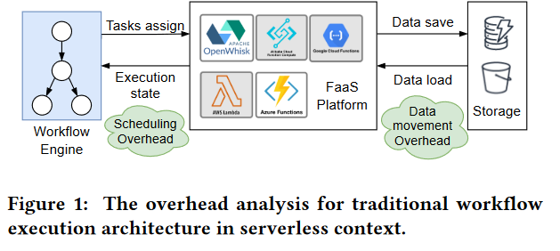

# 系统目标

- 构建一套基于事件驱动的有限状态机模型的函数编排系统，可以编排不同云平台上的 Serverless 函数
  - 异构平台的标准化
    - 支持不同云平台函数的运行时
    - 支持不同云平台的事件处理
  - 高效执行
    - 基于事件驱动的有限状态机模型
    - 函数并行度优化
  - 简单部署
    - 前端：函数式编程
    - 中端：Workflow 静态图
    - 后端：运行时组件

# 模型构建

## 有限状态机模型

使用有限状态机管理触发器

## 事件抽象

事件作为外部输入关系触发器

## 函数流

# 参考文献

## [Triggerflow: Trigger-based orchestration of serverless workflows](https://www.sciencedirect.com/science/article/pii/S0167739X21001989)

### 解决问题

现有的云编排系统要么专注于短期运行的工作流程，要么为同步大规模并行作业带来相当大的开销。没有能够对自定义工作流进行可扩展拦截以及优化的开放系统

- 短期运行：IBM Composer、Amazon Step Functions Express Workflows
- 大开销：Azure Durable Functions、Amazon Step Functions

### 工作难点

- 通过 CEP 规则执行业务流程

  - CEP：Complex Event Processing
- 使用触发器做服务工作流编排是可能的但是往往不理想

  - 有必要为每个步骤创建不同的队列或目录
  - 触发器不能够一直等到前面多个函数的执行结束
  - 触发器不适用于错误处理

### 相关工作

- 利用基于内容的发布/订阅系统中的复合订阅来提供分散的基于事件的工作流程管理 [link.springer.com](https://link.springer.com/chapter/10.1007/11587552_13)
- [serverlessworkflow.io](https://serverlessworkflow.io/) 该工作提出将工作流声明为 YAML 文件，其中包含要使用的 CloudEvents 概述、无服务器函数的事件驱动调用以及工作流数据管理和控制流逻辑的状态转换。

  - 定义了一个可以被不同系统解释的抽象定义，从而保证可移植性避免供应商锁定
- 当下的 Serverless 编排系统大多数依赖于集中式的服务器资源（虚拟机）或者是专有资源

  - 坏处
    - 不能将资源占有量降为 0
    - 工作流执行时编排组件持续活跃，工作流执行时间长时造成资源浪费
- IBM Composer 生成一个状态机代表着即将要被执行的 IBM Cloud Functions

  - 能够表示顺序、条件分支、循环、并行以及任务映射
  - `fork/join` 同步阻塞了外部用户提供的 `Redis` 服务，限制了其对短期运行任务的适用性
- Amazon Step Functions and Amazon Step Functions Express Workflows 使用 JSON 模型化任务转移、选择、等待、并行、映射，ASF 是一个支持 Workflow 错误容忍服务，ASFE 时用户支撑短时运行的工作负载
- 微软的 Azure Durable Functions（ADF）提出了使用代码生成 Workflows 的方式，使用 `async/await` 结构，使用事件源重启被挂起的工作流

  - 不支持映射工作
  - 只包含了 `Task.whenAll` 抽象来实现 `fork/join`
- 谷歌云提供了 Google Cloud Workflows 服务。它的工作流包括了一系列的基于逻辑的步骤，逻辑类似于条件或者循环。可以通过对每一个步骤发出一个 HTTP Request 的方式来触发 Google Cloud Function

  - 不适合用来做广播的并行任务

### 模型定义

- ECA 模型：Event-Condition-Action, `Event Sources` and `Programmable Conditions` and `Actions`

  - 包含触发器和规则：适合定义表示工作流的有限状态机的状态转移
- 触发器服务

  - Workflow: 由 6 元组组成的一个有限状态机
    - 输入事件的集合
    - 上下文变量
    - 将 Actions 映射到 ECA 模型
    - 初始状态
    - 终止状态
    - 状态转移方程，通过 ECA 触发器转移
  - Trigger: 可以看作是状态转移方程，由四元组构成
    - 事件：驱动云应用的院原子信息。使用 subject 字段匹配事件对应的触发器，使用 type 字段描述事件的类型
    - 上下文：一个 key-value 的数据结构，包含了触发器运行周期的状态
    - 条件：由用户定义的决定事件是否匹配行为
    - 行为：用于异步地触发一个 Serverless 函数

  > 触发器的生命周期可以表示如下：
  >
  > 1. 一个事件由某些事件源产生
  > 2. 事件被系统消费，激活对应的触发器
  > 3. 事件由 Condition 函数处理，若结果是正确的，就交由 Action 函数处理
  > 4. Action 函数被激活了，就称作该触发器被 fired
  > 5. 当一个触发器被 fired 的时候，他就可以被 disabled 或者由系统 maintain
  >    - Mapping Workflows to Triggers：一个工作流可以通过一系列触发器进行映射
  >    - 任意工作流抽象都可以通过有限状态机表示，可以被转化为各种各样的触发器，并且通过 TriggerFlow 表示
  >    - Substitution Principle：工作流本身通过初始化和终止遵守操作。工作流可以嵌套
  >    - Dynamic Trigger Interception：

- 错误容忍：
  - 事件总线保证事件的至少一次传递
    - 事件可以重复无序
  - 通过 CloudEvent 标准为每个事件赋予一个 ID
    - 在事件处理阶段，同样 ID 的事件就会丢弃
  - 通过辨别两种事件组合类型来处理无序消息
    - 聚合：如计数器。由于消息顺序不会改变最终结果，故不用考虑
    - 序列：仅仅处理激活序列开头的触发器的事件，其他事件将被延迟，直到启用他们激活的触发器

## [Comparison of FaaS Orchestration Systems](https://ieeexplore.ieee.org/abstract/document/8605772)

### 解决问题

本文章比较了四种函数编排平台 AWS Lambda, IBM Cloud Functions, Google Cloud Functions,Azure Functions

### 相关工作

- IBM Serverless 的三大难题

  - 函数需要在一个沙箱中进行
  - 函数组合应该遵循同步调用的替换原则（即组合也应该是一个函数）
  - 调用不应该重复计费
- 编排函数不需要外部的运行时支持

  - 两种解决模式
    - 使用函数进行编排
      - 函数的编排是在一个 Serverless 函数中进行的
      - 带来双重付费的问题
    - 使用外部的客户端进行编排
      - 能够解决双重付费问题
      - 不能视为函数，违反替换原则

### 评估模型

- ST-safeness：符合三难困境的编排服务被称为 STsafe。
- Programming model：编程简单性和编码抽象集，是否提供反射 API 来观察函数组合的当前状态。
- Parallel execution support：并行执行支持
- State management：数据如何从一个函数转移到下一个函数
- Architecture：编排器是客户端调度程序或者是本身就是一个函数，用于事件的响应
- Overhead：鉴于编排服务对函数调度程序的依赖，应针对代表性函数组合（例如链和并行模式）来衡量编排开销的重要性
- Billing model

### 评估结果

|                               | ST-safeness                  | Programming model                                                                                           | Parallel execution support | State management   | Architecture       | Overhead                 |
| ----------------------------- | ---------------------------- | ----------------------------------------------------------------------------------------------------------- | -------------------------- | ------------------ | ------------------ | ------------------------ |
| Amazon Step Functions (ASF)   | 不满足，因为函数编排不是函数 | - 支持顺序和分支，函数重试以及并行。- 只能静态图- 提供了反射 API 查询状态以及取消执行- 通过 CloudWatch 监控 | 支持                       | 32KB 的限制        | 外部编排器         |                          |
| IBM Composer                  | 满足，也是第一个满足的       | - 提供了完整的编排库- 不提供并行的 DSL- 但是可以将函数作为前端接口暴露- 不支持反射 API，只能通过日志        | 不支持                     | 5MB 的状态转移限制 | 集成在反应式核心中 | 提供了包，支持用户上传包 |
| Azure Durable Functions (ADF) | 满足                         | - 通过 C#代码创建函数流- 提供了反射 API，不仅能获取当前的状态，也能触发事件到一个挂起的函数                 | 支持                       | 不限制             | 外部编排器         | 提供了非常简单的包       |

## [FaaSFlow: enable efficient workflow execution for function-as-a-service](https://dl.acm.org/doi/10.1145/3503222.3507717)

### 解决问题

- 传统的 master-worker 架构性能太差
  - master 的调度模式，通过该模式，功能在 master 节点中触发并分配给工作节点来执行。
  - worker 之间的数据移动也会降低吞吐量。

> These serverless workflow systems usually provide a centralized workflow engine on the master node to manage the workflow execution state and assign function tasks to the worker nodes. We refer to this scheduling pattern as master-side workflow schedule pattern (denoted by MasterSP), as the central workflow engine in the master node determines whether a function task is triggered to run or not
> 
> 这些无服务器工作流系统通常在主节点上提供集中式工作流引擎来管理工作流执行状态并将功能任务分配给工作节点。我们将这种调度模式称为主端工作流调度模式（记为 MasterSP），由主节点中的中央工作流引擎决定是否触发功能任务运行

- 带来的问题
  - 中央工作流引擎负责动态管理和调度所有功能。函数执行状态频繁地从主节点转移到工作节点，带来大量的调度开销。由于函数很短，这种传输会频繁发生。
  - 引擎“随机”将触发的函数分发到工作节点以实现负载均衡，云厂商对函数的输入输出数据大小进行配额，以避免严重消耗网络带宽。在生产无服务器平台中，用户通常依赖额外的数据库存储服务来进行临时数据存储和交付，从而承受巨大的数据移动开销

### 工作难点

- WorkerSP: 大规模工作流划分为控制平面以及数据平面

  - worker 函数可以执行自动缩放并重用热容器，这导致控制平面中的每个功能节点在数据中可能具有多个不同的数据平面
  - 在无服务器工作流的实际控制平面（用户预定义）和数据平面（数据依赖）不一定相同的情况下，将大规模工作流划分为两个不同平面的多个工作人员时具有挑战性
  - 考虑到集群中资源动态变化的前提，还需要一种基于实时资源可用性来划分和调度工作流的机制
- FaaStore: 利用主内存在函数之间交换数据

  - 没有理论指导

### 相关工作

- 函数冷启动问题
- Serverless Workflow 优化

### 模型定义

- FaaSFlow
  - 工作流图调度程序在 `Master` 节点上运行。图调度器解析用户上传的工作流，根据每个工作节点上的可用资源和相邻功能之间传输的数据量将工作流划分为子图。
  - 在每个 `Worker` 节点上，
    - FaaSFlow 运行一个 `pre-worker` 工作流引擎来管理函数状态并触发本地函数任务，
    - 一个集成的 FaaStore 在运行时动态分配容器中超额配置的内存
  - FaaStore
    - 使用适当的数据存储（容器中分配良好的主内存或远程存储）来支持基于功能的位置和依赖性的通信。

#### Graph Scheduler

#### Per-Worker Workflow Engine

#### Memory Reclamation in FaaStore

### 开源代码

[https://github.com/lzjzx1122/FaaSFlow](https://github.com/lzjzx1122/FaaSFlow)
